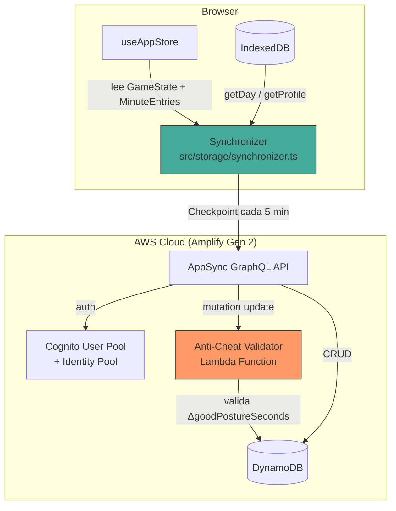
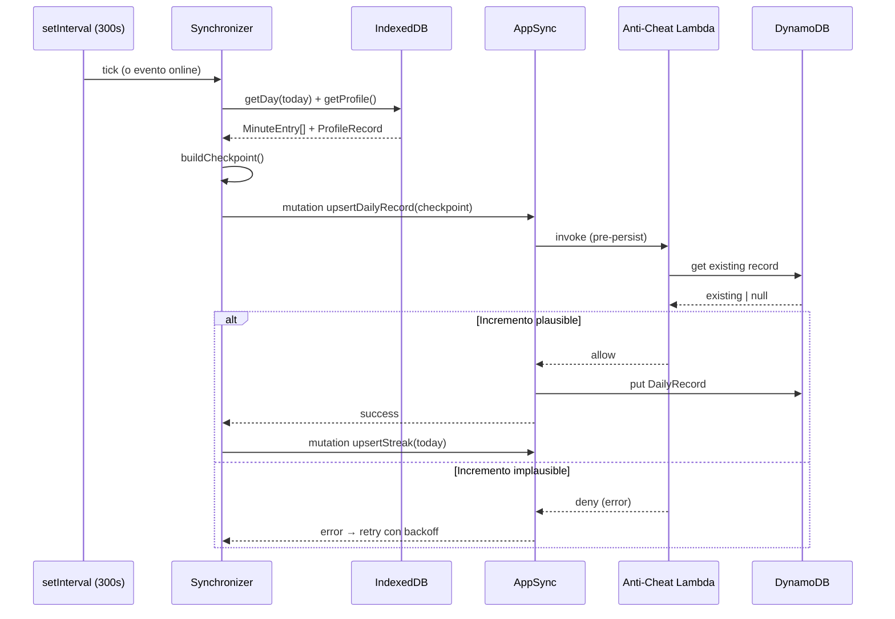

# Design Document — backend-nube

## Overview

Este diseño cubre la capa de backend cloud para SpineHero, implementada con AWS Amplify Gen 2. El backend es un complemento opcional: la app funciona al 100% sin él. Su propósito es:

1. Persistir estadísticas diarias agregadas (`Checkpoint`) en DynamoDB vía AppSync.
2. Mantener racha de días consecutivos (`Streak`) por usuario.
3. Habilitar un ranking por equipo consultable por `teamCode`.
4. Validar en servidor que los incrementos de `goodPostureSeconds` sean plausibles (anti-trampa).

**Principio rector:** Lo único que sale del navegador es el objeto `Checkpoint` de `src/contracts/sync.ts`. Nunca frames, landmarks ni datos biométricos.

## Architecture



### Flujo de sincronización



## Components and Interfaces

### 1. `amplify/auth/resource.ts` — Configuración Auth

```typescript
import { defineAuth } from '@aws-amplify/backend';

export const auth = defineAuth({
  loginWith: { email: true },
  // Habilita identidades no autenticadas (guest)
  // para lectura de rankings sin registrarse
});
```

Cognito provee:
- **Authenticated users**: pueden hacer CRUD sobre sus propios `DailyRecord` y `Streak`, y leer rankings.
- **Unauthenticated (guest)**: solo pueden leer `DailyRecord` filtrados por `teamCode` (para ver rankings sin registrarse).

### 2. `amplify/data/resource.ts` — Schema de datos

Define los modelos `DailyRecord` y `Streak` con autorización y el índice secundario para ranking por equipo.

### 3. `amplify/data/anti-cheat-validator.ts` — Lambda de validación

Función Lambda adjunta como handler a la mutación de update de `DailyRecord`. Valida que el incremento de `goodPostureSeconds` no supere el tiempo real transcurrido + 10% de margen.

### 4. `src/storage/synchronizer.ts` — Sincronizador del lado cliente

```typescript
export interface SynchronizerConfig {
  intervalMs: number;        // 300_000 (5 min)
  maxRetries: number;        // 3
  baseRetryMs: number;       // 1_000
}

export interface Synchronizer {
  start(): void;
  stop(): void;
  syncNow(): Promise<void>;  // fuerza un sync inmediato
}

export function createSynchronizer(config?: Partial<SynchronizerConfig>): Synchronizer;
```

Responsabilidades:
- Timer de 300s que construye un `Checkpoint` agregando datos de IndexedDB.
- Escucha `window.addEventListener('online', ...)` para sync inmediato al reconectar.
- Retry con backoff exponencial (1s → 2s → 4s), máximo 3 intentos.
- No envía nada si `!navigator.onLine` o no hay sesión autenticada.

### 5. `src/storage/streakCalculator.ts` — Lógica de racha

```typescript
export interface StreakState {
  currentDays: number;
  bestDays: number;
  lastActiveDate: string; // YYYY-MM-DD
}

export function computeStreakUpdate(
  existing: StreakState | null,
  today: string
): StreakState;
```

Función pura que calcula el nuevo estado de racha. Reglas:
- Si `lastActiveDate === yesterday` → incrementa `currentDays`.
- Si `lastActiveDate < yesterday` → reset `currentDays = 1`.
- Si `lastActiveDate === today` → no-op (ya sincronizado hoy).
- Actualiza `bestDays` si `currentDays > bestDays`.

### 6. `src/storage/checkpointBuilder.ts` — Constructor de Checkpoint

```typescript
import type { Checkpoint } from '../contracts/sync';
import type { MinuteEntry } from './db';
import type { ProfileRecord } from './db';

export function buildCheckpoint(
  date: string,
  minutes: MinuteEntry[],
  profile: ProfileRecord,
  teamCode?: string
): Checkpoint;
```

Función pura que agrega `MinuteEntry[]` + `ProfileRecord` en un `Checkpoint`:
- `goodPostureSeconds` = suma de todos los `goodSeconds` de las entradas del día.
- `avgScore` = media aritmética de `avgScore` de las entradas (redondeada a entero).
- `longestFlowStreak` = tomado de `profile.gameState.flowSeconds / 60` (minutos).
- `level`, `xp` = del `profile.gameState`.

## Data Models

### DailyRecord (DynamoDB)

| Campo | Tipo | Restricciones |
|-------|------|---------------|
| id | ID (auto) | PK generado por Amplify |
| owner | String | Auto-asignado por Cognito (identityId) |
| date | AWSDate | Formato YYYY-MM-DD, requerido |
| goodPostureSeconds | Int | 0–86400, requerido |
| longestFlowStreak | Int | 0–1440 (minutos) |
| avgScore | Int | 0–100 |
| level | Int | ≥ 1 |
| xp | Int | ≥ 0 |
| teamCode | String | Max 20 chars, opcional |
| createdAt | AWSDateTime | Auto por Amplify |
| updatedAt | AWSDateTime | Auto por Amplify |

**Índice secundario (GSI):**
- Nombre: `byTeamCodeAndDate`
- Partition key: `teamCode`
- Sort key: `date`
- Proyección: ALL

**Autorización:**
- `allow.owner()` → create, update, delete
- `allow.authenticated().to(['read'])` → lectura para ranking
- `allow.guest().to(['read'])` → lectura para visitantes

**Amplify Gen 2 Schema:**

```typescript
const schema = a.schema({
  DailyRecord: a
    .model({
      date: a.date().required(),
      goodPostureSeconds: a.integer().required(),
      longestFlowStreak: a.integer(),
      avgScore: a.integer(),
      level: a.integer(),
      xp: a.integer(),
      teamCode: a.string(),
    })
    .secondaryIndexes((index) => [
      index('teamCode').sortKeys(['date']).queryField('listByTeamAndDate'),
    ])
    .authorization((allow) => [
      allow.owner(),
      allow.authenticated().to(['read']),
      allow.guest().to(['read']),
    ]),
```

### Streak (DynamoDB)

| Campo | Tipo | Restricciones |
|-------|------|---------------|
| id | ID (auto) | PK generado por Amplify |
| owner | String | Auto-asignado por Cognito |
| currentDays | Int | 0–365, default 0 |
| bestDays | Int | 0–365, default 0 |
| lastActiveDate | String | YYYY-MM-DD, requerido |
| createdAt | AWSDateTime | Auto |
| updatedAt | AWSDateTime | Auto |

**Autorización:**
- `allow.owner()` → todas las operaciones (solo el usuario puede ver/editar su racha)

```typescript
  Streak: a
    .model({
      currentDays: a.integer().required().default(0),
      bestDays: a.integer().required().default(0),
      lastActiveDate: a.string().required(),
    })
    .authorization((allow) => [allow.owner()]),
});
```

### Anti-Cheat Validator (Lambda)

```typescript
// amplify/data/anti-cheat-validator.ts
import type { AppSyncResolverHandler } from 'aws-lambda';

interface DailyRecordInput {
  id: string;
  date: string;
  goodPostureSeconds: number;
  // ... otros campos
}

export const handler: AppSyncResolverHandler<DailyRecordInput, DailyRecordInput> = async (event) => {
  const { goodPostureSeconds } = event.arguments.input;
  
  // 1. Rechazar si > 86400 (máximo absoluto)
  if (goodPostureSeconds > 86_400) {
    throw new Error('goodPostureSeconds excede el máximo diario de 86400');
  }

  // 2. Si existe registro previo, verificar incremento vs tiempo transcurrido
  const existing = await getExistingRecord(event.identity.sub, event.arguments.input.date);
  if (existing) {
    const increment = goodPostureSeconds - existing.goodPostureSeconds;
    if (increment > 0) {
      const elapsedMs = Date.now() - new Date(existing.updatedAt).getTime();
      const elapsedSeconds = elapsedMs / 1000;
      const maxAllowed = elapsedSeconds * 1.1; // margen del 10%
      if (increment > maxAllowed) {
        throw new Error('Incremento de goodPostureSeconds excede el tiempo transcurrido permitido');
      }
    }
  }

  // 3. Permitir la mutación
  return event.arguments.input;
};
```

### CSP Configuration

En `vite.config.ts` (para desarrollo) y en `amplify/hosting/custom-headers.yml` (para producción con Amplify Hosting):

```yaml
# amplify/hosting/custom-headers.yml (Amplify Hosting)
customHeaders:
  - pattern: '**/*'
    headers:
      - key: Content-Security-Policy
        value: >-
          default-src 'self';
          script-src 'self' 'unsafe-inline';
          style-src 'self' 'unsafe-inline';
          connect-src 'self' https://*.appsync-api.*.amazonaws.com;
          img-src 'self' data:;
          media-src 'self';
          font-src 'self';
          form-action 'self';
          frame-ancestors 'none';
      - key: Cross-Origin-Opener-Policy
        value: same-origin
      - key: Cross-Origin-Embedder-Policy
        value: require-corp
```

La directiva `connect-src` solo permite conexiones a `'self'` y al endpoint de AppSync. Cualquier intento de exfiltrar datos a otro origen será bloqueado por el navegador.

### Integración con el Store existente

El `Synchronizer` se inicializa en `useAppStore` cuando el usuario tiene sesión:

```typescript
// En useAppStore.ts (adiciones)
import { createSynchronizer } from '../storage/synchronizer';

let _synchronizer: Synchronizer | null = null;

// Al hacer login exitoso:
function onAuthReady() {
  _synchronizer = createSynchronizer();
  _synchronizer.start();
}

// Al hacer logout o perder sesión:
function onAuthLost() {
  _synchronizer?.stop();
  _synchronizer = null;
}
```

### Consulta de Ranking por equipo

```typescript
// Desde el componente de ranking
const { data } = await client.models.DailyRecord.listByTeamAndDate({
  teamCode: 'EQUIPO123',
  date: { eq: '2025-01-15' }, // fecha actual
});

// Transformar a TeamEntry[] ordenado por goodPostureSeconds desc
const ranking: TeamEntry[] = data
  .sort((a, b) => b.goodPostureSeconds - a.goodPostureSeconds)
  .map(record => ({
    displayName: record.owner, // o un campo displayName si se añade
    goodPostureSeconds: record.goodPostureSeconds,
    level: record.level ?? 1,
    streakDays: 0, // se obtiene de Streak aparte si es necesario
  }));
```


## Correctness Properties

*A property is a characteristic or behavior that should hold true across all valid executions of a system — essentially, a formal statement about what the system should do. Properties serve as the bridge between human-readable specifications and machine-verifiable correctness guarantees.*

### Property 1: Streak continuation preserves and updates correctly

*For any* valid `StreakState` where `lastActiveDate` equals yesterday's date, calling `computeStreakUpdate(state, today)` SHALL return a new state where `currentDays` equals the original `currentDays + 1`, `lastActiveDate` equals `today`, and `bestDays` equals `max(original.bestDays, original.currentDays + 1)`.

**Validates: Requirements 3.4**

### Property 2: Streak reset preserves bestDays

*For any* valid `StreakState` where `lastActiveDate` is strictly before yesterday's date, calling `computeStreakUpdate(state, today)` SHALL return a new state where `currentDays` equals 1, `lastActiveDate` equals `today`, and `bestDays` equals the original `bestDays` unchanged.

**Validates: Requirements 3.5**

### Property 3: Checkpoint aggregation invariants

*For any* non-empty array of `MinuteEntry[]` for a given date, any valid `ProfileRecord`, and any optional `teamCode` string (4-20 alphanumeric chars or undefined), calling `buildCheckpoint(date, minutes, profile, teamCode)` SHALL produce a `Checkpoint` where:
- `goodPostureSeconds` equals the sum of all `goodSeconds` values from the entries
- `avgScore` equals the rounded arithmetic mean of all `avgScore` values from the entries
- `level` equals `profile.gameState.level`
- `xp` equals `profile.gameState.xp`
- `teamCode` equals the provided `teamCode` parameter
- `date` equals the provided `date` parameter
- The output contains exactly and only the fields defined in the `Checkpoint` interface

**Validates: Requirements 4.2, 4.5, 6.5, 8.1**

### Property 4: Anti-cheat validation correctness

*For any* tuple of `(existingGoodPostureSeconds, newGoodPostureSeconds, elapsedSeconds)` where all values are non-negative integers:
- IF `newGoodPostureSeconds > 86400`, the validator SHALL reject regardless of other values.
- IF no existing record exists and `newGoodPostureSeconds <= 86400`, the validator SHALL accept.
- IF an existing record exists and `(newGoodPostureSeconds - existingGoodPostureSeconds) > elapsedSeconds * 1.1`, the validator SHALL reject.
- IF an existing record exists and `(newGoodPostureSeconds - existingGoodPostureSeconds) <= elapsedSeconds * 1.1`, the validator SHALL accept.

**Validates: Requirements 5.1, 5.2, 5.3, 5.4**

### Property 5: Ranking ordering invariant

*For any* non-empty array of `DailyRecord` entries with the same `teamCode` and `date`, applying the ranking sort SHALL produce a list where each element's `goodPostureSeconds` is greater than or equal to the next element's `goodPostureSeconds` (descending order).

**Validates: Requirements 6.3**

## Error Handling

### Errores del Sincronizador

| Error | Comportamiento |
|-------|---------------|
| Red no disponible (`!navigator.onLine`) | No intenta enviar. Espera evento `online`. |
| Mutación rechazada por anti-trampa | Loguea warning en consola. No reintenta (el dato es inválido). |
| Error de red transitorio (timeout, 5xx) | Backoff exponencial: 1s → 2s → 4s, máx 3 intentos. |
| 3 reintentos agotados | Descarta intento. Datos locales intactos. Próximo ciclo genera checkpoint fresco. |
| Amplify SDK no inicializado | Sincronizador no se crea. App opera en modo local sin errores. |
| Token de Cognito expirado | Amplify SDK renueva automáticamente. Si falla, sync se pausa hasta re-auth. |

### Errores de Auth

| Error | Comportamiento |
|-------|---------------|
| Credenciales incorrectas | Mostrar mensaje de error en UI. No emitir credenciales. |
| Red no disponible al login | Mostrar mensaje. App sigue funcionando en modo local. |
| Sesión expirada sin refresh posible | Volver a estado deslogueado. Sync se detiene. Datos locales intactos. |

### Errores de Consulta de Ranking

| Error | Comportamiento |
|-------|---------------|
| TeamCode no existe | Mostrar "No se encontraron resultados para este código". |
| Error de red al consultar | Mostrar mensaje de error con opción de reintentar. |
| Timeout (>3s) | Mostrar spinner hasta resultado o timeout del SDK. |

## Testing Strategy

### Property-Based Tests (Vitest + fast-check)

Se usará `fast-check` como librería de PBT (ya compatible con Vitest, no requiere dependencia adicional más allá de devDependency).

Cada property test se ejecuta con mínimo 100 iteraciones y referencia la propiedad del diseño:

```typescript
// Ejemplo de estructura
import fc from 'fast-check';
import { describe, it, expect } from 'vitest';

describe('checkpointBuilder', () => {
  it('Property 3: Checkpoint aggregation invariants', () => {
    fc.assert(
      fc.property(
        arbitraryMinuteEntries(),
        arbitraryProfileRecord(),
        fc.option(arbitraryTeamCode()),
        (minutes, profile, teamCode) => {
          const cp = buildCheckpoint('2025-01-15', minutes, profile, teamCode ?? undefined);
          // ... verificar invariantes
        }
      ),
      { numRuns: 100 }
    );
  });
});
```

**Ficheros de test:**
- `src/storage/checkpointBuilder.test.ts` → Property 3
- `src/storage/streakCalculator.test.ts` → Properties 1 y 2
- `amplify/data/anti-cheat-validator.test.ts` → Property 4
- `src/storage/rankingSort.test.ts` → Property 5

**Tags en cada test:**
- `// Feature: backend-nube, Property 1: Streak continuation preserves and updates correctly`
- `// Feature: backend-nube, Property 2: Streak reset preserves bestDays`
- `// Feature: backend-nube, Property 3: Checkpoint aggregation invariants`
- `// Feature: backend-nube, Property 4: Anti-cheat validation correctness`
- `// Feature: backend-nube, Property 5: Ranking ordering invariant`

### Unit Tests (Example-based)

- `src/storage/synchronizer.test.ts` — Timer behavior con fake timers, retry con backoff, sync on reconnect.
- `src/storage/streakCalculator.test.ts` — Caso null (primer streak), caso mismo día (no-op).
- Integración UI de ranking: empty state, campo de input con validación.

### Integration Tests

- Auth flow: login, guest access, owner-based access control.
- End-to-end sync: crear checkpoint, verificar en DynamoDB (contra sandbox de Amplify).
- Offline resilience: app loads and operates without backend.

### Smoke Tests

- Schema validation: verificar que el schema de Amplify contiene los modelos con los campos y autorizaciones correctas.
- CSP headers presentes en build de producción.
- Amplify sandbox deploys sin errores.

### Dependencia de test adicional requerida

- `fast-check` como devDependency para property-based testing.
