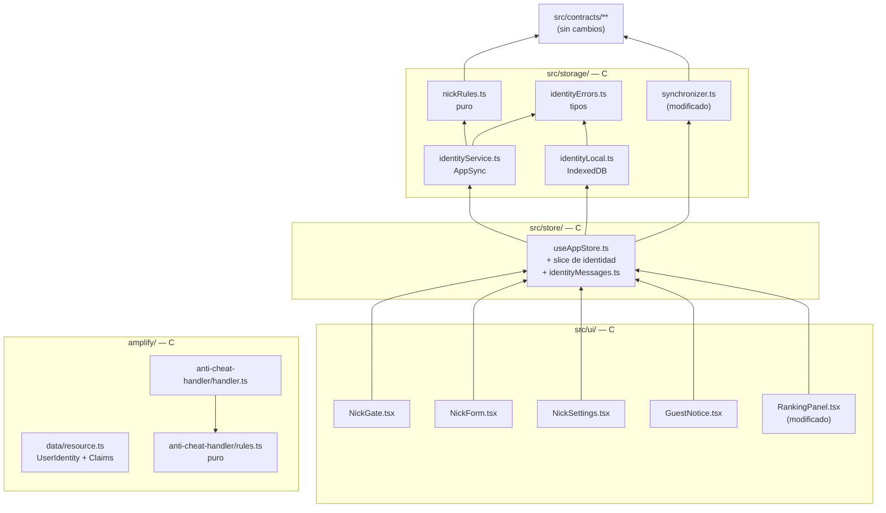
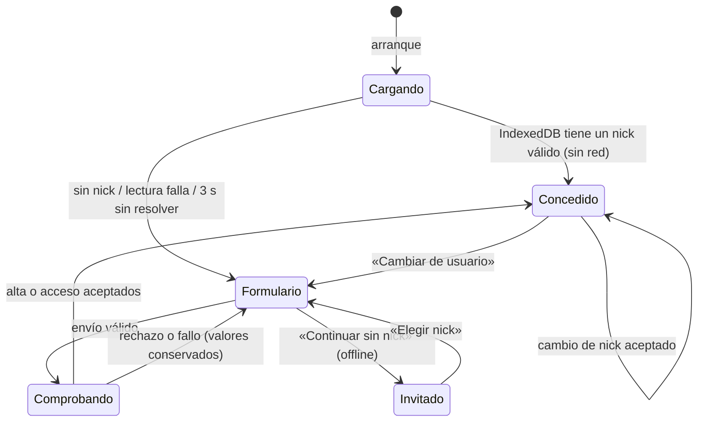
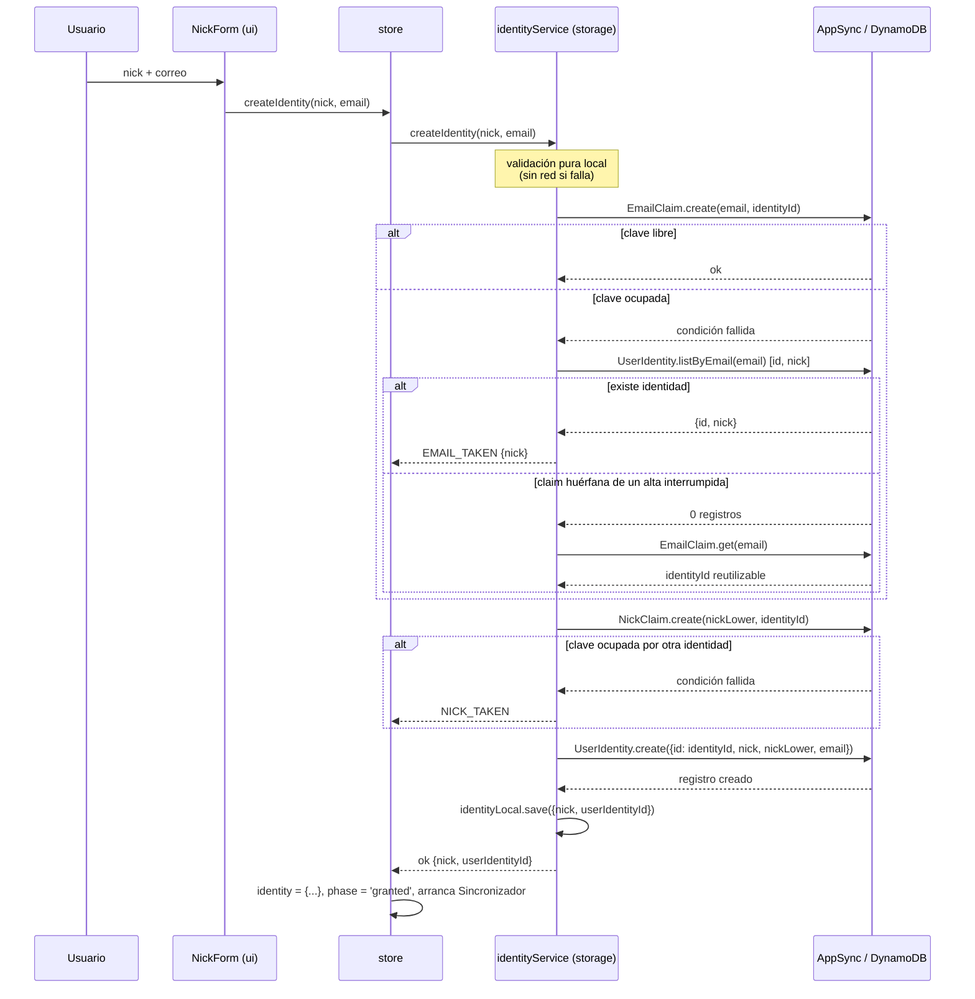
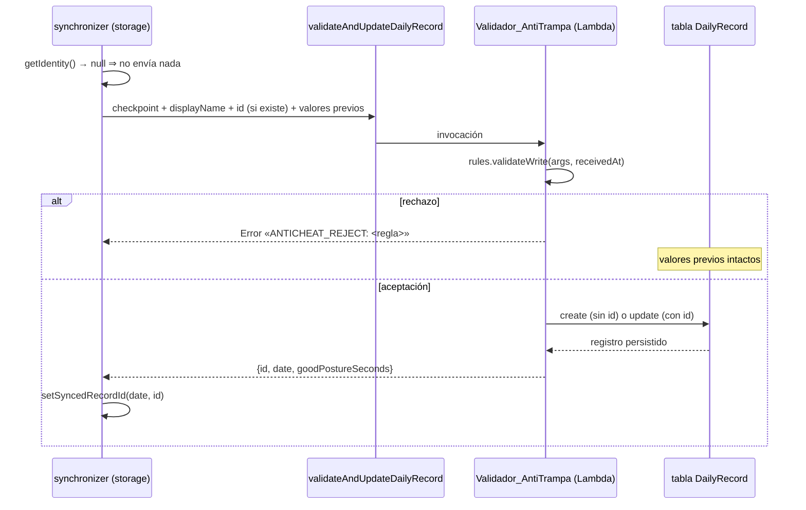

# Documento de Diseño

## Overview

Esta funcionalidad sustituye la identidad de Cognito (email + contraseña) por una
identidad **sin contraseña basada en un nick**, guardada en un modelo nuevo de
Amplify Gen 2 (`UserIdentity`) y recordada en IndexedDB. Cognito se queda
únicamente como emisor de las **Credenciales_Invitado** con las que la aplicación
habla con AppSync.

El diseño se articula en cuatro piezas y una retirada:

| Pieza | Dónde vive | Responsabilidad |
|---|---|---|
| Reglas de nick y correo (puras) | `src/storage/nickRules.ts` | Normalizar y validar. Sin red, sin DOM. |
| Sistema_Identidad | `src/storage/identityService.ts` + `identityLocal.ts` | Alta, acceso, cambio de nick, persistencia local. Único módulo que habla con `UserIdentity`. |
| Estado de identidad | `src/store/useAppStore.ts` | Un campo con el Nick activo y su id. Traduce `IdentityError` a mensaje en español. |
| Interfaz | `src/ui/NickGate.tsx`, `NickForm.tsx`, `NickSettings.tsx`, `GuestNotice.tsx` | Formulario_Acceso en dos modos, cambio de nick, aviso de sesión sin nick. |
| Retirada | `src/main.tsx`, `src/ui/SyncControl.tsx`, `amplify/data/resource.ts` | Fuera `Authenticator`, fuera `allow.owner()`, fuera `allow.authenticated()`. |

Al retirar `allow.owner()` de `DailyRecord`, la defensa del ranking deja de
apoyarse en «quién escribe» y pasa a apoyarse en «qué números escribe»: el
**Validador_AntiTrampa** deja de ser un simple comprobador de incrementos y se
convierte en la **única vía de escritura** del Sincronizador, con seis reglas de
rango y coherencia más una ventana de fecha.

Decisión de fondo que ordena todo lo demás: **la unicidad no se comprueba
leyendo y luego escribiendo**. Una lectura seguida de una escritura siempre tiene
una ventana de carrera. La unicidad de nick y de correo se delega a la condición
de escritura que DynamoDB aplica sobre la clave de partición, usando dos modelos
auxiliares con identificador personalizado (`NickClaim`, `EmailClaim`). Los
índices secundarios de `UserIdentity` sobre `nickLower` y `email` se usan para
*informar* al usuario (mensajes, nick asociado a un correo), no para garantizar
la unicidad.

### Investigación previa

Tres hallazgos condicionan el diseño:

1. **Validación de campos en el esquema.** Amplify Gen 2 admite validadores de
   campo encadenando `.validate()`: `minLength`, `maxLength` y `matches` para
   strings, y comparadores numéricos para enteros
   ([Field-level validation](https://docs.amplify.aws/nextjs/build-a-backend/data/field-level-validation/)).
   Cubre el Requisito 6 criterio 10 en longitudes y alfabeto, pero **no** admite
   reglas entre campos, así que la igualdad `nickLower === nick.toLowerCase()` no
   puede verificarse en el servidor sin una Lambda (ver Desviación D2).
   Los patrones de `matches` los evalúa el motor de regex de Java y exigen
   escapado cuádruple de los metacaracteres; los patrones de este diseño solo
   usan clases de caracteres literales, así que no hace falta escapar nada.
2. **Identificadores personalizados y escritura condicional.** Un modelo con
   `.identifier(['campo'])` tiene ese campo como clave de partición, y la
   mutación `create` que genera Amplify escribe condicionada a que la clave no
   exista. Dos `create` simultáneos con la misma clave dejan exactamente uno
   persistido: el segundo falla en el servidor, sin registro parcial. Es la
   comprobación del lado servidor que piden los criterios 6.4 y 6.5.
3. **No se añaden dependencias npm.** Confirmado con el usuario: el proyecto no
   incorpora librería de property-based testing ni `@testing-library/react`. Las
   propiedades de corrección de este documento se escriben igualmente y se
   ejecutan con Vitest sobre un generador determinista propio (ver Testing
   Strategy). El diseño se mantiene testeable en Node: toda la lógica que las
   propiedades cubren vive en funciones puras o en módulos con el cliente de
   datos inyectado.

## Architecture

### Mapa de módulos y dirección de dependencias



Reglas de frontera que el diseño respeta (Requisito 11):

- `src/contracts/**` queda con **diff vacío**. El Nick viaja en el campo
  `displayName` que ya existe en `DailyRecord` y en `TeamEntry`. `Checkpoint` no
  se toca. Los tipos nuevos (`ActiveIdentity`, `IdentityError`,
  `IdentityResult`) se declaran en `src/storage/`.
- `src/storage/` importa de `src/` solo desde `src/contracts/`. En particular
  **no importa el store**: el Sincronizador recibe el Nick activo por
  inyección (`getIdentity`), no leyendo Zustand (ver Desviación D1).
- `src/ui/` importa solo de `src/contracts/` y `src/store/`. Los mensajes de
  error en español se resuelven en el store (`identityMessages.ts`), así que la
  interfaz nunca importa `src/storage/`.
- `src/vision/`, `src/posture/`, `src/game/`, `src/feedback/` y `src/pip/`
  quedan con diff vacío. La Lambda **no** importa `src/game/engine.ts`
  (`amplify/` y `src/` no comparten grafo de módulos): las constantes de nivel se
  duplican en `rules.ts` con un comentario que apunta al original.

### Máquina de estados de la identidad



`Cargando` nunca bloquea el resto de la aplicación: la detección de postura, el
motor de juego y la escritura de minutos arrancan al margen de esta máquina
(Requisito 12 criterio 4). Lo único que la fase de identidad decide es si se
muestra el Formulario_Acceso y si el Sincronizador tiene permiso para hablar con
AppSync.

### Flujo del alta (modo «Crear nick»)



Por qué el correo primero: es el valor **permanente** (un correo no libera nunca
su nick). Si el nick está ocupado, la claim de correo queda huérfana y el propio
usuario la reutiliza al reintentar con otro nick, porque la verdad sobre «este
correo ya tiene nick» es el registro `UserIdentity`, no la claim. Ninguna claim se
borra nunca: no se autoriza `delete` en ninguno de los dos modelos auxiliares.

### Flujo de escritura del DailyRecord



El Sincronizador **no escribe el modelo directamente**: la mutación es su único
camino, de modo que las reglas del Requisito 13 y la ventana de fecha del
Requisito 6 criterio 14 se aplican a todas sus escrituras. El modelo mantiene
`create`/`read`/`update` autorizados a invitados porque lo exige el Requisito 6
criterio 11; que otro cliente pueda saltarse la mutación es exactamente la
exposición que el Requisito 10 criterio 9 obliga a declarar en `docs/PRIVACY.md`.

## Components and Interfaces

### `src/storage/nickRules.ts` (puro)

Constantes arriba y exportadas, sin números mágicos incrustados:

```ts
export const NICK_MIN_LENGTH = 3;
export const NICK_MAX_LENGTH = 16;
export const NICK_PATTERN = /^[A-Za-z0-9_-]{3,16}$/;
export const NICK_LOWER_PATTERN = /^[a-z0-9_-]{3,16}$/;
export const EMAIL_MIN_LENGTH = 6;
export const EMAIL_MAX_LENGTH = 254;
/** texto@dominio.tld: ≥1 antes de @, ≥1 punto en el dominio, ≥2 tras el último. */
export const EMAIL_PATTERN = /^[^\s@]+@[^\s@.]+(\.[^\s@.]+)*\.[^\s@.]{2,}$/;

/** Recorta extremos. No cambia la capitalización: el nick visible es el escrito. */
export function normalizeNick(raw: string): string;
/** Minúsculas ASCII del nick ya recortado. Clave de unicidad. */
export function toNickLower(nick: string): string;
/** Recorta extremos y pasa a minúsculas ASCII. */
export function normalizeEmail(raw: string): string;

export function isValidNick(raw: string): boolean;
export function isValidEmail(raw: string): boolean;
```

`toLowerCase()` de JavaScript es sensible al locale para algunos caracteres
(la `I` turca), pero el alfabeto admitido del nick es ASCII puro, así que la
conversión es cerrada sobre ese alfabeto. El correo se normaliza con
`toLowerCase()` sobre la cadena completa; los caracteres no ASCII sobreviven sin
transformar, lo que basta para el único uso del correo: comparar igualdad.

### `src/storage/identityErrors.ts`

Unión discriminada, nada de excepciones con cadenas (convención del proyecto):

```ts
export interface ActiveIdentity {
  nick: string;            // tal como está almacenado en UserIdentity
  userIdentityId: string;  // id inmutable del registro
}

export type IdentityError =
  | { kind: 'NICK_INVALID' }
  | { kind: 'EMAIL_INVALID' }
  | { kind: 'NICK_TAKEN' }
  | { kind: 'EMAIL_TAKEN'; nick: string }
  | { kind: 'NICK_EMAIL_MISMATCH' }
  | { kind: 'OFFLINE' }
  | { kind: 'TIMEOUT' }
  | { kind: 'BACKEND'; detail: string }
  | { kind: 'LOCAL_WRITE_FAILED' };

export type IdentityResult<T> =
  | { ok: true; value: T }
  | { ok: false; error: IdentityError };
```

### `src/storage/identityLocal.ts` (Almacen_Local_Identidad)

```ts
export async function loadLocalIdentity(): Promise<IdentityResult<ActiveIdentity | null>>;
export async function saveLocalIdentity(identity: ActiveIdentity): Promise<IdentityResult<void>>;
export async function clearLocalIdentity(): Promise<IdentityResult<void>>;
```

Escribe un único registro con clave `'current'`. Nunca guarda el correo
(Requisito 9 criterio 8). Una lectura que devuelva un nick que no cumple el
patrón se trata como ausencia de nick, no como error: el Formulario_Acceso se
muestra y el contenido local no se borra (Requisito 4 criterio 7).

### `src/storage/identityService.ts` (Sistema_Identidad)

Recibe el cliente de datos por parámetro para ser testeable en Node con un doble
en memoria; en producción el store le pasa `generateClient<Schema>()`.

```ts
export const IDENTITY_TIMEOUT_MS = 10_000;   // abandono duro (Req 8.7, 12.3)

export interface IdentityDataClient {
  createEmailClaim(email: string, identityId: string): Promise<ClaimResult>;
  getEmailClaim(email: string): Promise<{ identityId: string } | null>;
  createNickClaim(nickLower: string, identityId: string): Promise<ClaimResult>;
  getNickClaim(nickLower: string): Promise<{ identityId: string } | null>;
  findByNickLower(nickLower: string): Promise<ActiveIdentity | null>;
  findByEmail(email: string): Promise<ActiveIdentity | null>;
  createIdentity(record: UserIdentityInput): Promise<ActiveIdentity | null>;
  updateNick(id: string, nick: string, nickLower: string): Promise<ActiveIdentity | null>;
}

export type ClaimResult = { ok: true } | { ok: false; reason: 'TAKEN' | 'FAILED' };

export function createIdentityService(client: IdentityDataClient): IdentityService;

export interface IdentityService {
  /** Modo «Crear nick». */
  signUp(rawNick: string, rawEmail: string): Promise<IdentityResult<ActiveIdentity>>;
  /** Modo «Ya tengo nick». Exige el correo con el que se reclamó el nick. */
  signIn(rawNick: string, rawEmail: string): Promise<IdentityResult<ActiveIdentity>>;
  /** Cambio de nick conservando id y correo. */
  changeNick(current: ActiveIdentity, rawNick: string): Promise<IdentityResult<ActiveIdentity>>;
}
```

Decisiones de comportamiento:

- **Validación antes de red.** `signUp`/`signIn`/`changeNick` devuelven
  `NICK_INVALID` o `EMAIL_INVALID` sin emitir ninguna operación (Requisito 2
  criterio 7, Requisito 5 criterio 5).
- **`navigator.onLine === false`** ⇒ `OFFLINE` inmediato, sin red (Requisito 12
  criterio 6). Es la única lectura del navegador que hace el servicio.
- **Presupuestos de tiempo.** Cada operación se envuelve en un `withTimeout` de
  10 s que corta y devuelve `TIMEOUT`. Los plazos de 3 s de los requisitos se
  cumplen por diseño, no por temporizador: toda consulta de unicidad es **una
  sola** petición resuelta por índice o por clave de partición.
- **`signIn` comprueba la titularidad consultando por correo**, no por nick
  (Requisito 2 criterios 3 y 11). La comprobación necesita enfrentar dos
  valores, y el que se traiga del Sistema_Data es el que queda expuesto:
  consultando por nick habría que traerse el `email` almacenado para
  compararlo en el navegador, y entonces cualquiera que supiese un nick podría
  leer el correo de su titular. Consultando por correo, lo que vuelve es el
  nick —un dato que el Ranking_Equipo ya publica— y el correo almacenado nunca
  sale del servidor. Un solo `findByEmail`, sin `findByNickLower`.
- **`signIn` adopta el nick almacenado**, no el escrito: `findByEmail` devuelve
  `{nick, id}` y ese `nick` es el que se persiste (Requisito 2 criterio 3).
- **Un único rechazo en `signIn`.** `NICK_EMAIL_MISMATCH` cubre tanto «ese
  correo no tiene identidad» como «la tiene con otro nick» (Requisito 2
  criterio 9): separarlos permitiría averiguar qué correos están registrados
  probando un nick conocido contra una lista de direcciones.
- **`changeNick`** primero consulta `findByNickLower`; si hay una identidad
  distinta de la propia ⇒ `NICK_TAKEN`. Si el `nickLower` no cambia (solo varía
  la capitalización) se salta la claim y actualiza directamente. Nunca envía el
  correo (Requisito 9 criterio 1).
- **Selección de campos.** `findByNickLower` pide `['id','nick']`. `findByEmail`
  pide `['id','nick']`: el correo viaja como argumento, nunca de vuelta.

### `src/storage/synchronizer.ts` (modificado)

```ts
export interface SynchronizerDeps {
  /** Nick activo y su id, o null si no hay identidad. Inyectado por el store. */
  getIdentity: () => ActiveIdentity | null;
}

export function createSynchronizer(
  deps: SynchronizerDeps,
  config?: Partial<SynchronizerConfig>,
): Synchronizer;
```

Cambios respecto al código actual:

1. Fuera `fetchAuthSession` y `fetchUserAttributes`. La guarda de envío pasa a
   ser `getIdentity() !== null` (Requisito 14 criterios 8 y 9, Requisito 7
   criterio 4).
2. `displayName = getIdentity()!.nick`, tal cual está almacenado.
3. Fuera `syncStreak` y toda referencia al modelo `Streak` (Requisito 14
   criterio 9). La racha visible sale de `GameState.streakDays`.
4. La escritura se hace **siempre** por `client.mutations.validateAndUpdateDailyRecord`,
   con `id` presente solo si `getSyncedRecordId(date)` lo tiene. La respuesta
   devuelve el `id` persistido, que se guarda en el store `sync` de IndexedDB:
   así se cumple «como máximo un DailyRecord por Nick y fecha» incluso si el
   primer intento falló después de haber escrito (el reintento reutiliza el id
   si lo hay, y si no, el rechazo por fecha o el fallo de red no crean nada).
5. `isAntiCheatRejection` se mantiene tal cual: solo un mensaje con el token
   `ANTICHEAT_REJECT` es trampa; cualquier otro fallo es infraestructura y se
   reintenta con el backoff que ya existe (Requisito 13 criterio 13).

### `src/store/useAppStore.ts` (slice de identidad)

```ts
export type IdentityPhase = 'loading' | 'form' | 'granted' | 'guest';
export type NickFormMode = 'signIn' | 'signUp';

interface IdentitySlice {
  identity: ActiveIdentity | null;      // único campo con el Nick activo (Req 4.3)
  identityPhase: IdentityPhase;
  identityBusy: boolean;                // «Comprobando…» (Req 8.3)
  identityMessage: string | null;       // ya traducido a español
  identityMessageField: 'nick' | 'email' | 'both' | null;
  emailTakenNick: string | null;        // habilita «Entrar con ese nick» (Req 3.3)
  localSaveFailed: boolean;             // aviso no bloqueante (Req 4.8)

  bootstrapIdentity: () => Promise<void>;
  signUpNick: (nick: string, email: string) => Promise<void>;
  signInNick: (nick: string, email: string) => Promise<void>;
  changeNick: (nick: string) => Promise<void>;
  switchUser: () => Promise<void>;      // «Cambiar de usuario»
  continueWithoutNick: () => void;
  openNickForm: () => void;             // «Elegir nick»
}
```

El store es el único puente entre `storage` y `ui`, y el único que decide cuándo
arranca y para el Sincronizador:

- Al pasar a `granted` arranca `createSynchronizer({ getIdentity: () => get().identity })`
  y fuerza un `syncNow()` (Requisito 7 criterio 5: checkpoint en ≤10 s).
- `switchUser()` borra el registro local, pone `identity = null`, para el
  Sincronizador y vuelve a `form`. **No toca** el registro remoto (Requisito 4
  criterio 5).
- `changeNick()` actualiza `identity` en la misma acción que escribe IndexedDB
  (Requisito 4 criterio 6) y no toca `game`, `calibration` ni `teamCode`.
- Los mensajes se resuelven con `identityMessages.ts`, un mapa puro
  `IdentityError → { text: string; field: 'nick' | 'email' | null }` con los
  literales exactos de los requisitos. Así la interfaz no importa `storage`.

### Componentes de interfaz (`src/ui/`)

| Componente | Responsabilidad | Criterios que cubre |
|---|---|---|
| `NickGate.tsx` | Envuelve `Dashboard`. Llama a `bootstrapIdentity()` al montar y elige entre pantalla de carga, `NickForm` o `Dashboard`. | 1.1, 4.2, 12.5 |
| `NickForm.tsx` | Formulario_Acceso en dos modos, mensajes, foco, `aria-*`, «Continuar sin nick», aviso de identidad no verificada. | 1.6–1.11, 2.1–2.8, 3.2–3.4, 8.1–8.11, 10.5, 12.1, 12.6 |
| `nickFormState.ts` | Función pura de la interfaz: `canSubmit(mode, nick, email, busy)`. Saca la regla del botón deshabilitado del componente para poder testearla sin DOM. | 8.3, 8.4, 8.5 |
| `NickSettings.tsx` | Dentro de `ControlPanel`: formulario de cambio de nick precargado y control «Cambiar de usuario». | 4.4, 5.1–5.7 |
| `GuestNotice.tsx` | Aviso no modal de sesión sin nick, con «Elegir nick» y cierre. Estado de visibilidad local al componente. | 12.2, 12.8 |
| `RankingPanel.tsx` | `buildRanking` deja de mirar `owner` (ya no existe), sustituye `displayName` vacío o en blanco por «Anónimo», recorta a 50 filas y toma `streakDays` del `GameState` solo para la fila propia. | 7.3, 7.9, 10.6, 14.9 |
| `SyncControl.tsx` | Se queda solo con «Sincronizar ahora» y el indicador de estado. Fuera `Authenticator` y `useAuthenticator`. | 14.7 |
| `main.tsx` | Fuera `Authenticator.Provider` y `@aws-amplify/ui-react/styles.css`. `Amplify.configure` en `try/catch` para no bloquear el arranque. | 12.5, 14.7 |

Detalles de accesibilidad que el diseño fija (Requisito 8): cada campo con
`htmlFor`/`id`, el texto de ayuda y el error referenciados con
`aria-describedby`, `aria-invalid="true"` en el campo rechazado, los mensajes en
un contenedor con `role="alert"`, foco trasladado al primer campo con error, y
`maxLength` de 16 y 254 en los dos campos. Tema oscuro único, clases de
Tailwind v4 y `Press Start 2P` desde `public/fonts/` (sin peticiones externas).

### `amplify/data/anti-cheat-handler/rules.ts` (nuevo, puro)

Separar las reglas del handler es lo que permite testearlas con Vitest sin AWS:

```ts
export const MAX_DAILY_SECONDS = 86_400;
export const TIMEZONE_SLACK_SECONDS = 50_400;   // Req 13.5
export const FLOW_ROUNDING_SLACK_SECONDS = 60;  // Req 13.6
export const TOLERANCE_FACTOR = 1.1;            // Req 13.9
export const DATE_WINDOW_DAYS = 1;              // Req 6.14
// Duplicados de src/game/engine.ts: amplify/ no puede importar de src/.
export const LEVEL_BASE_XP = 100;
export const LEVEL_EXPONENT = 1.5;

export type AntiCheatRule =
  | 'DAILY_MAX' | 'ELAPSED_TODAY' | 'FLOW_VS_GOOD'
  | 'AVG_SCORE_RANGE' | 'LEVEL_XP_COHERENCE' | 'INCREMENT_VS_ELAPSED'
  | 'DATE_WINDOW';

export type AntiCheatVerdict =
  | { ok: true }
  | { ok: false; rule: AntiCheatRule; message: string };

export function validateWrite(input: CheckpointClaim, receivedAtMs: number): AntiCheatVerdict;
```

`validateWrite` evalúa en orden: `DATE_WINDOW`, `DAILY_MAX`, `ELAPSED_TODAY`,
`FLOW_VS_GOOD`, `AVG_SCORE_RANGE`, `LEVEL_XP_COHERENCE` y, **solo si llegan los
valores previos**, `INCREMENT_VS_ELAPSED`. Los seis primeros no leen los campos
`previous*`, que es lo que exige el criterio 13.3: el veredicto de las reglas
absolutas es independiente de lo que el cliente diga sobre su pasado.

`handler.ts` queda reducido a: invocar `validateWrite`, lanzar
`Error(\`${ANTICHEAT_REJECT_TOKEN}: ${verdict.message}\`)` si rechaza y, si
acepta, persistir (`create` sin `id`, `update` con `id`) y devolver
`{ id, date, goodPostureSeconds }`.

## Data Models

### Esquema de Amplify (`amplify/data/resource.ts`)

```ts
UserIdentity: a
  .model({
    nick: a.string().required().validate((v) =>
      v.minLength(3, 'nick demasiado corto')
       .maxLength(16, 'nick demasiado largo')
       .matches('^[A-Za-z0-9_-]{3,16}$', 'nick con caracteres no permitidos')),
    nickLower: a.string().required().validate((v) =>
      v.minLength(3, 'nickLower demasiado corto')
       .maxLength(16, 'nickLower demasiado largo')
       .matches('^[a-z0-9_-]{3,16}$', 'nickLower debe estar en minúsculas')),
    email: a.string().required().validate((v) =>
      v.minLength(6, 'correo demasiado corto')
       .maxLength(254, 'correo demasiado largo')),
  })
  .secondaryIndexes((index) => [
    index('nickLower').queryField('listByNickLower'),
    index('email').queryField('listByEmail'),
  ])
  .authorization((allow) => [allow.guest().to(['create', 'read', 'update'])]),

NickClaim: a
  .model({ nickLower: a.string().required(), identityId: a.string().required() })
  .identifier(['nickLower'])
  .authorization((allow) => [allow.guest().to(['create', 'read'])]),

EmailClaim: a
  .model({ email: a.string().required(), identityId: a.string().required() })
  .identifier(['email'])
  .authorization((allow) => [allow.guest().to(['create', 'read'])]),

DailyRecord: a
  .model({ /* campos sin cambios */ })
  .secondaryIndexes((index) => [
    index('teamCode').sortKeys(['date']).queryField('listByTeamAndDate'),
  ])
  .authorization((allow) => [allow.guest().to(['create', 'read', 'update'])]),

validateAndUpdateDailyRecord: a
  .mutation()
  .arguments({
    id: a.string(),                    // ahora opcional: sin id ⇒ create
    date: a.date().required(),
    displayName: a.string().required(), // el Nick
    goodPostureSeconds: a.integer().required(),
    previousGoodPostureSeconds: a.integer(),
    previousUpdatedAt: a.string(),
    longestFlowStreak: a.integer(),
    avgScore: a.integer(),
    level: a.integer(),
    xp: a.integer(),
    teamCode: a.string(),
  })
  .returns(a.ref('ValidatedUpdateResult'))
  .authorization((allow) => [allow.guest()])
  .handler(a.handler.function(antiCheatValidator)),
```

Cambios respecto al esquema actual, uno a uno:

| Cambio | Motivo |
|---|---|
| `UserIdentity` nuevo con dos índices secundarios | Req 6.1, 6.2, 6.3 |
| `NickClaim` y `EmailClaim` con identificador personalizado | Req 6.4, 6.5: unicidad garantizada por la condición de escritura |
| `DailyRecord`: fuera `allow.owner()` y `allow.authenticated().to(['read'])` | Req 6.11 |
| `DailyRecord`: `allow.guest().to(['create','read','update'])` | Req 6.11 y 6.12 (sin `delete`) |
| `UserIdentity`: sin `delete` para invitados | Req 6.9 |
| Mutación: `allow.authenticated()` → `allow.guest()` | Req 13.2 |
| Mutación: `id` opcional y `displayName` añadido; la Lambda persiste | Req 13.10, 13.11, 6.8 |
| Índice `teamCode`+`date` de `DailyRecord` | Sin cambios (Req 6.15) |
| Modelo `Streak` | Se conserva en el esquema pero queda sin uso (Req 14.9) |

`amplify/auth/resource.ts` se mantiene con `loginWith: { email: true }`: es el
mínimo que `defineAuth` acepta y lo que hace que el identity pool emita
Credenciales_Invitado (Req 14.7). Lo que desaparece es el uso de ese login en la
interfaz, no el recurso.

### IndexedDB (`src/storage/db.ts`)

```ts
export interface LocalIdentityRecord {
  nick: string;            // tal como está en UserIdentity
  userIdentityId: string;  // id del registro remoto
}

// SpineHeroDB gana un store; DB_VERSION pasa de 2 a 3.
identity: {
  key: string;             // 'current'
  value: LocalIdentityRecord;
};
```

La migración solo crea el store nuevo (`if (oldVersion < 3)`): `minutes`,
`profile` y `sync` se conservan intactos, que es lo que garantiza que el
progreso sobreviva al alta, al cambio de nick y a «Cambiar de usuario»
(Requisitos 5.4 y 12.7). El correo **no aparece** en ningún store.

### Modelo de estado en el store

| Campo | Tipo | Valor inicial |
|---|---|---|
| `identity` | `ActiveIdentity \| null` | `null` |
| `identityPhase` | `'loading' \| 'form' \| 'granted' \| 'guest'` | `'loading'` |
| `identityBusy` | `boolean` | `false` |
| `identityMessage` | `string \| null` | `null` |
| `identityMessageField` | `'nick' \| 'email' \| null` | `null` |
| `emailTakenNick` | `string \| null` | `null` |
| `localSaveFailed` | `boolean` | `false` |

Se retira `isAuthenticated` y las acciones `onAuthReady`/`onAuthLost`: su papel
lo asume `identityPhase`.

### Mensajes (literales exactos)

| Error | Mensaje | Campo |
|---|---|---|
| `NICK_INVALID` | «El nick debe tener entre 3 y 16 caracteres: letras, números, guion o guion bajo» | `nick` |
| `EMAIL_INVALID` | «Introduce un correo electrónico válido» | `email` |
| `NICK_TAKEN` | «Ese nick ya está en uso, prueba otro» | `nick` |
| `EMAIL_TAKEN` | «Ese correo ya tiene el nick «{nick}» asociado. Entra con él o usa otro correo» | `email` |
| `NICK_EMAIL_MISMATCH` | «Ese nick y ese correo no coinciden. Comprueba los dos e inténtalo de nuevo» | `both` |
| `OFFLINE` | «Sin conexión para comprobar el nick. Puedes continuar sin nick» | `nick` |
| `TIMEOUT` / `BACKEND` | «No se pudo comprobar el nick. Revisa tu conexión e inténtalo de nuevo» | `null` |
| `LOCAL_WRITE_FAILED` | «Tu nick no se ha podido guardar para el próximo arranque» | `null` |

## Correctness Properties

*Una propiedad es una característica o comportamiento que debe cumplirse en todas
las ejecuciones válidas del sistema: una afirmación formal sobre lo que el
software tiene que hacer. Las propiedades son el puente entre la especificación
legible por personas y una garantía de corrección verificable por máquina.*

Las diecisiete propiedades siguientes salen del análisis de los criterios de
aceptación y de su consolidación (los criterios de documentación, apariencia y
configuración se cubren con revisiones y pruebas de humo, no con propiedades).

### Property 1: La normalización del nick es idempotente y coherente

*Para cualquier* cadena, `normalizeNick` aplicado dos veces da el mismo resultado
que aplicado una vez, y *para cualquier* nick válido, `toNickLower` es idempotente,
cumple `^[a-z0-9_-]{3,16}$`, conserva la longitud del nick y el par que el
Sistema_Identidad envía siempre satisface `nickLower === toNickLower(nick)`.

**Validates: Requirements 1.3, 6.10**

### Property 2: Un nick se acepta exactamente cuando cumple el patrón

*Para cualquier* cadena, el Sistema_Identidad la acepta como Nick si y solo si,
tras recortar los extremos, tiene entre 3 y 16 caracteres de letras ASCII,
dígitos, guion bajo y guion; cuando la rechaza devuelve `NICK_INVALID` y no emite
ninguna operación al Sistema_Data.

**Validates: Requirements 1.2, 1.6, 2.7, 5.5, 8.4**

### Property 3: Un correo se acepta exactamente cuando cumple patrón y longitud

*Para cualquier* cadena, `normalizeEmail` es idempotente y no deja espacios en los
extremos, y el Sistema_Identidad la acepta como Correo_Vinculado si y solo si su
forma normalizada mide entre 6 y 254 caracteres y cumple `texto@dominio.tld`; en
caso contrario devuelve `EMAIL_INVALID` sin emitir ninguna operación.

**Validates: Requirements 1.4, 1.7, 8.5**

### Property 4: Como máximo un UserIdentity por Nick_Normalizado

*Para cualquier* secuencia de altas y cambios de nick, incluidas las intercaladas
que compiten por el mismo `nickLower`, al terminar existe como máximo un registro
UserIdentity con cada valor de `nickLower`, cada intento perdedor recibe
`NICK_TAKEN`, y ni el almacén remoto ni el Almacen_Local_Identidad cambian por
causa de un intento perdedor.

**Validates: Requirements 1.8, 5.6, 6.4**

### Property 5: Como máximo un UserIdentity por Correo_Vinculado

*Para cualquier* secuencia de altas, incluidas las intercaladas con el mismo correo
escrito con distinta capitalización o con espacios en los extremos, al terminar
existe como máximo un registro UserIdentity con cada correo normalizado, y cada
intento perdedor recibe `EMAIL_TAKEN` cuyo `nick` es el del registro que sí quedó
creado.

**Validates: Requirements 1.9, 3.1, 3.2, 3.6, 6.5**

### Property 6: El acceso concedido deja store y almacén local coherentes

*Para cualquier* concesión de acceso (alta, acceso con nick existente o cambio de
nick aceptado), el Almacen_Local_Identidad contiene exactamente un registro con
el `nick` tal como está almacenado en UserIdentity y con el identificador de ese
registro, el campo del store contiene el mismo par, y ninguno de los dos contiene
el Correo_Vinculado.

**Validates: Requirements 1.5, 4.1, 4.3, 4.6, 5.3, 9.8**

### Property 7: Ningún fallo de identidad deja rastro

*Para cualquier* modo de fallo (nick ocupado, correo ocupado, nick inexistente,
error de backend, respuesta que no llega antes del plazo, `navigator.onLine` en
`false` o fallo de lectura del almacén local), el Almacen_Local_Identidad queda
byte a byte como estaba, el registro UserIdentity afectado queda sin cambios, el
Nick activo anterior se conserva y la fase de identidad nunca pasa a `granted`.

**Validates: Requirements 1.10, 2.4, 2.8, 4.7, 5.7, 8.7, 12.3, 12.6**

### Property 8: Entrar, salir y volver a entrar es un round trip de identidad

*Para cualquier* identidad registrada y *cualquier* variación de capitalización con
que se escriba su nick, el acceso en modo «Ya tengo nick» concede la identidad con
el `nick` exacto del registro (no el escrito) y con su identificador; y tras
«Cambiar de usuario», volver a entrar con ese mismo nick devuelve el mismo par
`{nick, id}`, sin haber creado ni modificado ningún registro UserIdentity.

**Validates: Requirements 2.3, 2.5, 3.4, 4.4, 4.5**

### Property 9: El fallo de escritura local no revoca el acceso

*Para cualquier* concesión de acceso en la que la escritura en el
Almacen_Local_Identidad falle, la identidad sigue activa en el store durante la
sesión y el estado expone el aviso no bloqueante de que el nick no se ha podido
guardar.

**Validates: Requirements 4.8**

### Property 10: El cambio de nick preserva identificador, correo y progreso

*Para cualquier* identidad activa y *cualquier* nick nuevo válido y libre, tras el
cambio el identificador y el Correo_Vinculado del registro son los mismos, el
`nick` y el `nickLower` son los nuevos, ninguna operación emitida transporta el
correo, y el `GameState` (con `xp`, `level`, `hp`, `streakDays` y `achievements`),
la calibración y el `teamCode` de IndexedDB_Local quedan idénticos. La misma
preservación se cumple al pasar de una sesión iniciada sin nick a una con nick.

**Validates: Requirements 5.2, 5.4, 12.7**

### Property 11: Como máximo un DailyRecord por Nick y fecha

*Para cualquier* secuencia de sincronizaciones de una misma fecha, incluidas las
que fallan y se reintentan, el Sincronizador provoca como máximo una creación de
DailyRecord para esa combinación de Nick y fecha, las demás escrituras son
actualizaciones del identificador ya guardado, y los datos de la fecha siguen en
IndexedDB_Local después de cualquier fallo.

**Validates: Requirements 7.6, 7.7, 7.8**

### Property 12: Forma de toda escritura del Sincronizador

*Para cualquier* Nick activo, perfil local y checkpoint, cada operación que el
Sincronizador emite lleva `displayName` igual al Nick activo tal cual está
almacenado, `date` igual a la fecha local actual, `teamCode` igual al del perfil
(ausente si el perfil no tiene ninguno) y ninguna operación se dirige al modelo
Streak; y *para cualquier* sesión sin Nick activo, el número de operaciones
emitidas es cero.

**Validates: Requirements 5.8, 5.9, 6.13, 7.1, 7.2, 7.4, 12.1, 14.8, 14.9**

### Property 13: El ranking ordena, recorta y anonimiza sin filtrar nada más

*Para cualquier* lista de DailyRecord, `buildRanking` devuelve como máximo 50
entradas ordenadas de forma no creciente por `goodPostureSeconds`, cada entrada
tiene exactamente los cuatro campos de `TeamEntry`, y toda entrada cuyo
`displayName` de origen sea ausente, vacío o solo espacios muestra «Anónimo»
conservando la posición que le da su `goodPostureSeconds`.

**Validates: Requirements 7.3, 7.9, 9.4, 10.6**

### Property 14: Superficie de datos salientes

*Para cualquier* secuencia de operaciones del producto (alta, acceso, cambio de
nick y sincronizaciones), el conjunto de claves y valores que salen del navegador
está contenido en la unión de los campos de `Checkpoint`, el `displayName`, el
`nick`, el `nickLower`, el `email` y los identificadores de registro; y el `email`
aparece únicamente en las operaciones del alta, en ninguna otra operación ni en
ninguna respuesta consumida por la interfaz.

**Validates: Requirements 9.1, 9.2, 9.3, 9.7, 9.10**

### Property 15: El veredicto anti-trampa es la conjunción de sus reglas

*Para cualquier* combinación de `date`, instante de recepción, `goodPostureSeconds`,
`longestFlowStreak`, `avgScore`, `level` y `xp`, el Validador_AntiTrampa acepta si
y solo si se cumplen simultáneamente las siete reglas (ventana de fecha de un día,
máximo diario de 86 400, tiempo transcurrido del día más 50 400 s, racha de flow
por 60 menor que los segundos buenos más 60, `avgScore` en 0-100, coherencia
`umbral(level-1) ≤ xp < umbral(level)` con `level ≥ 1`, e incremento respecto al
valor previo menor que el tiempo transcurrido por 1,1); y el veredicto de las seis
primeras reglas no cambia al variar `previousGoodPostureSeconds` ni
`previousUpdatedAt`.

**Validates: Requirements 6.14, 13.3, 13.4, 13.5, 13.6, 13.7, 13.8, 13.9, 13.12**

### Property 16: Efecto del veredicto y clasificación del fallo

*Para cualquier* entrada rechazada, el Validador_AntiTrampa no emite ninguna
escritura (los valores del DailyRecord de esa combinación de `displayName` y
`date` quedan intactos) y devuelve un mensaje que empieza por `ANTICHEAT_REJECT` y
nombra la regla incumplida; *para cualquier* entrada aceptada emite exactamente
una escritura y devuelve el identificador, la fecha y los segundos persistidos; y
*para cualquier* mensaje de error, el Sincronizador lo trata como trampa si y solo
si contiene el token, tratando el resto como infraestructura reintentable sin
perder los datos locales.

**Validates: Requirements 13.1, 13.10, 13.11, 13.13, 6.8**

### Property 17: El botón de envío refleja exactamente la validez del formulario

*Para cualquier* modo activo, contenido de los campos y estado de operación en
curso, el envío está habilitado si y solo si no hay operación en curso y los
campos del modo activo son válidos (solo el Nick en «Ya tengo nick»; Nick y
correo en «Crear nick»), de modo que un mismo envío no puede generar más de un
registro UserIdentity.

**Validates: Requirements 1.11, 8.3, 8.4, 8.5**

## Error Handling

### Errores tipados, nunca cadenas lanzadas

Todo el camino de identidad devuelve `IdentityResult<T>`. El único `throw` que
sobrevive es el de la Lambda, porque AppSync propaga los errores de un handler
como excepciones y el token `ANTICHEAT_REJECT` es el contrato con el cliente.

| Situación | Error | Efecto en la interfaz | Efecto en el estado |
|---|---|---|---|
| Nick fuera del patrón | `NICK_INVALID` | Mensaje literal, `aria-invalid` en el campo de nick, foco en él | Ninguna operación de red |
| Correo fuera del patrón | `EMAIL_INVALID` | Mensaje literal en el campo de correo | Ninguna operación de red |
| `nickLower` ocupado | `NICK_TAKEN` | «Ese nick ya está en uso, prueba otro» | Sin registro nuevo, sin escritura local |
| Correo ocupado | `EMAIL_TAKEN {nick}` | Mensaje con el nick y control «Entrar con ese nick» | Sin registro nuevo, sin escritura local |
| Pareja (nick, correo) que no coincide en «Ya tengo nick» | `NICK_EMAIL_MISMATCH` | «Ese nick y ese correo no coinciden…» en los dos campos + control para pasar a «Crear nick» conservando lo escrito | Sin cambios |
| `navigator.onLine === false` | `OFFLINE` | Mensaje de sin conexión y «Continuar sin nick» visible | Ninguna operación de red |
| Sin respuesta en 10 s | `TIMEOUT` | Mensaje de reintento con control habilitado | Operación abandonada, sin cambios |
| Error de AppSync o del backend | `BACKEND {detail}` | Mismo mensaje de reintento | Sin cambios; `detail` no se muestra al usuario |
| Escritura local fallida | `LOCAL_WRITE_FAILED` | Aviso no bloqueante | Acceso mantenido en la sesión |

### Compensación y estados intermedios del alta

El alta escribe en tres sitios, así que hay estados intermedios posibles. La
regla de diseño es que **ningún estado intermedio bloquea a nadie de forma
permanente**:

| Falla en | Estado que queda | Cómo se recupera |
|---|---|---|
| `EmailClaim.create` por condición | Nada escrito | Se consulta `listByEmail`: si hay identidad ⇒ `EMAIL_TAKEN`; si no, la claim es huérfana y el alta continúa reutilizando su `identityId` |
| `NickClaim.create` por condición | Claim de correo huérfana | El usuario reintenta con otro nick; la claim de correo se reutiliza por la regla anterior |
| `UserIdentity.create` | Dos claims huérfanas | El reintento las reutiliza; ninguna queda inservible |

No se autoriza `delete` en `NickClaim` ni en `EmailClaim`: nada que borrar
significa nada que un tercero pueda liberar. El precio es que un nick abandonado
queda reservado, que en un ranking de hackathon es irrelevante.

### Errores de sincronización

Se conserva la clasificación que ya existe y que el Requisito 13 criterio 13
exige: `isAntiCheatRejection` mira el token. Con token, se abandona el envío del
checkpoint (no es reintentable: los números son los que son). Sin token, es
infraestructura: reintento con backoff exponencial (3 intentos, base 1 s) y los
minutos siguen en IndexedDB_Local para el siguiente ciclo.

### Fallos de arranque

`Amplify.configure` va en `try/catch`. Si falla, el estado marca el backend como
no disponible y el Formulario_Acceso se muestra con «Continuar sin nick»
habilitado: el arranque de la aplicación nunca depende de que la nube responda
(Requisito 12 criterio 5).

## Testing Strategy

### Enfoque doble sin dependencias nuevas

El usuario ha decidido no añadir dependencias npm, así que no hay librería de
property-based testing ni utilidades de render de React. Consecuencias, explícitas:

- **Las propiedades se escriben y se ejecutan**, pero con un generador
  determinista propio en `src/storage/__tests__/gen.ts`: un PRNG xorshift32 con
  semilla fija más generadores de nick, correo, checkpoint, `GameState` y
  secuencias de operaciones. Cada propiedad recorre **200 casos** (por encima del
  mínimo de 100) y, al fallar, imprime la semilla y el caso para poder
  reproducirlo. No hay reducción automática del contraejemplo: eso es lo que se
  pierde respecto a una librería de PBT.
- **Las propiedades que necesitan DOM no se automatizan.** Por eso la regla del
  botón se extrae a `canSubmit` (Propiedad 17), que se testea sin DOM. El foco,
  `role="alert"`, el orden de tabulación y el contraste se verifican a mano con
  las herramientas del navegador.
- Cada test de propiedad lleva la etiqueta
  `// Feature: identidad-nick, Property N: <texto de la propiedad>` y una única
  propiedad por test.

### Dobles de prueba

| Doble | Sustituye a | Qué simula |
|---|---|---|
| `fakeIdentityClient` | `IdentityDataClient` | Claims con condición de clave (segundo `create` con la misma clave ⇒ `TAKEN`), índices en memoria, inyección de fallos y de retardo infinito, y **traza de todas las operaciones** con sus argumentos (base de las Propiedades 12 y 14) |
| `fakeLocalIdentity` | `identityLocal` | Lectura/escritura en memoria con fallos y retardos inyectables |
| `fakeDailyRecordWriter` | Cliente de la Lambda | Cuenta creaciones y actualizaciones por `(displayName, date)` |
| Temporizadores falsos de Vitest | Reloj | Plazos de 3 y 10 s sin esperar |

### Reparto de tests

| Fichero | Tipo | Cubre |
|---|---|---|
| `src/storage/nickRules.test.ts` | Propiedades 1, 2, 3 + ejemplos de frontera | Validación y normalización |
| `src/storage/identityService.test.ts` | Propiedades 4, 5, 7, 8, 10, 14 | Alta, acceso, cambio de nick, unicidad, privacidad |
| `src/storage/identityLocal.test.ts` | Propiedades 6, 9 | Persistencia local y sus fallos |
| `src/storage/synchronizer.test.ts` (ampliado) | Propiedades 11, 12, 16 (parte del cliente) | Un registro por nick y fecha, forma de la escritura, clasificación del error |
| `src/ui/nickFormState.test.ts` | Propiedad 17 | Habilitación del envío |
| `src/ui/rankingBuild.test.ts` | Propiedad 13 | Orden, recorte, «Anónimo» y forma de `TeamEntry` |
| `amplify/data/anti-cheat-handler/rules.test.ts` | Propiedades 15, 16 (parte del handler) | Las siete reglas, su independencia de los valores previos y el efecto del veredicto |

### Pruebas de integración y de humo (1-3 ejemplos, no propiedades)

Contra `npx ampx sandbox`, porque comprueban AWS y no nuestro código:

- Consultas `listByNickLower` y `listByEmail` devuelven 0 o 1 registros por
  índice (Req 6.2, 6.3).
- `create` duplicado de `NickClaim` y de `EmailClaim` falla en el servidor
  (Req 6.4, 6.5).
- `delete` de `UserIdentity` y de `DailyRecord` devuelve error de autorización
  (Req 6.9, 6.12).
- Los validadores de campo rechazan un `nick` de 2 caracteres y un `nickLower`
  con mayúsculas (Req 6.10).
- La mutación `validateAndUpdateDailyRecord` se invoca sin sesión de Cognito
  (Req 13.2) y `listByTeamAndDate` sigue resolviendo el ranking (Req 6.15).
- `npm run build` de producción: sin violaciones de CSP durante alta y acceso, y
  la fuente cargada desde `public/fonts/` (Req 8.1, 9.6, 9.9).
- Búsqueda en `src/`: cero apariciones de `Authenticator`, `useAuthenticator`,
  `fetchUserAttributes` y `fetchAuthSession` (Req 14.7, 14.8).
- `git diff` vacío en `src/contracts/`, `src/vision/`, `src/posture/`,
  `src/game/`, `src/feedback/` y `src/pip/` (Req 11.1-11.7).

### Verificación manual de la demo

Recorrido corto que valida los plazos de los requisitos: alta con nick y correo
(<3 s hasta el Dashboard), recarga (Dashboard directo sin red), cambio de nick
(ranking actualizado en el siguiente ciclo), «Cambiar de usuario» y reentrada con
el mismo nick, y modo avión con «Continuar sin nick».

## Desviaciones declaradas y notas de coordinación

Estas cuatro cosas se apartan de la letra de los requisitos o del enfoque
habitual. Ninguna cambia el comportamiento visible; todas son decisiones que
conviene aprobar antes de implementar, y cualquiera de ellas justifica volver a la
fase de requisitos si prefieres ajustar el texto.

**D1 — El Sincronizador recibe el Nick por inyección, no leyendo el store.**
El Requisito 14 criterio 8 dice que el Sincronizador obtiene el `displayName` del
store de Zustand. Hacerlo con un import rompería la dirección de dependencias de
`structure.md` (`storage` no puede importar `store`). El diseño mantiene la
intención (el Nick activo del store es la única fuente) con una función
`getIdentity` que el store le pasa al crearlo.

**D2 — La igualdad `nickLower === lowercase(nick)` no se valida en el servidor.**
Los validadores de campo de Amplify Gen 2 son por campo: cubren longitudes y
alfabeto (incluido que `nickLower` no tenga mayúsculas), pero no comparan dos
campos entre sí. Cumplir el Requisito 6 criterio 10 al pie de la letra exigiría
enrutar toda escritura de `UserIdentity` por una Lambda. Para un hackathon de seis
días la relación coste/beneficio no sale: la coherencia la garantiza la Propiedad 1
en el cliente y el servidor rechaza igualmente los casos que importan (longitud,
alfabeto, mayúsculas en `nickLower`).

**D3 — El alta escribe la claim de correo, además de la consulta de existencia y
de la creación del registro.** El Requisito 9 criterio 1 enumera dos operaciones
que transportan el correo. La garantía atómica del Requisito 6 criterio 5 obliga a
una tercera: `EmailClaim.create`, que es a la vez comprobación y reserva. Va al
mismo endpoint de AppSync y no cambia nada de la invariante de privacidad (el
correo no se persiste en local, no llega al ranking, no viaja en el acceso ni en el
cambio de nick). Si prefieres exactitud literal, el criterio 9.1 debería decir
«tres operaciones del alta».

**D4 — Las propiedades se ejecutan con un generador propio, no con una librería de
PBT.** Consecuencia directa de no añadir dependencias. Se pierde la reducción
automática de contraejemplos y las propiedades sobre el DOM del Formulario_Acceso,
que pasan a verificación manual. Si en algún momento se acepta añadir `fast-check`
como dependencia de desarrollo, los tests se migran sin tocar las propiedades de
este documento.

**Nota de coordinación (Requisito 11 criterio 3).** Este diseño no modifica
`src/contracts/**`. Los tipos nuevos `ActiveIdentity`, `IdentityError` y
`IdentityResult` viven en `src/storage/`. Si más adelante V o M necesitan
`ActiveIdentity`, ese es el momento de acordar su promoción a contratos, no antes.
