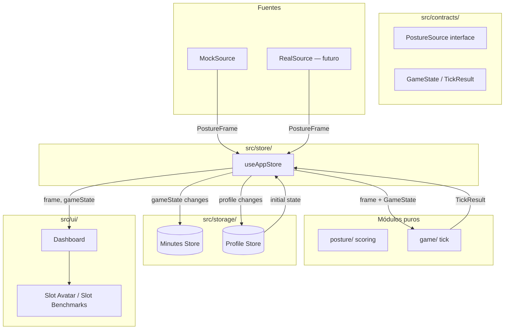

# Design Document — Shell App

## Overview

Shell-app es la capa de orquestación front-end de SpineHero. Proporciona:

1. **Store global (Zustand)** — `src/store/useAppStore.ts`. Conecta PostureSource, motor de juego y UI sin contener lógica de negocio.
2. **Mock PostureSource** — `src/contracts/mockSource.ts` (ya implementado). Fuente de frames cíclica para desarrollo.
3. **Dashboard** — `src/ui/Dashboard.tsx`. Componente principal que muestra estado, controles, estadísticas del día y slots para componentes futuros.
4. **Persistencia local (IndexedDB)** — `src/storage/`. Almacena datos por minuto y perfil de juego usando la biblioteca `idb`.

La responsabilidad del shell es conectar módulos puros existentes (`src/posture/`, `src/game/`) con la UI y el almacenamiento, sin reimplementar sus reglas.

### Decisiones clave

| Decisión | Justificación |
|---|---|
| Zustand sin middleware de persistencia | El debounce de 5 s y la lógica de batching por minuto requieren control fino incompatible con `persist` de Zustand |
| Un solo store, no slices separados | La app tiene un solo flujo de datos (frame → tick → UI); separar complicaría la suscripción cruzada |
| `idb` para IndexedDB | Ya está en `package.json`, wrapper ligero con API async nativa |
| Dashboard como componente único con slots | Permite integración paralela del avatar canvas y benchmarks panel sin merge conflicts |
| Mock source ya vive en `src/contracts/` | Respeta el contrato actual; no se mueve |

## Architecture



### Flujo de datos (un tick)

1. PostureSource emite `PostureFrame` vía suscripción.
2. El store recibe el frame, lo almacena, y llama a `tick(gameState, frame, Date.now())`.
3. El store reemplaza `gameState` con `TickResult.state` y expone `TickResult.events` al UI.
4. El módulo de persistencia (observer) ve el cambio de estado y lo acumula en el buffer de minuto.
5. Al cruzar el límite de minuto (o al detener), el buffer se escribe a IndexedDB.
6. Los cambios de perfil (level up, XP, logros) disparan un write debounced (≤1 cada 5 s) al Profile Store.

### Dirección de dependencias

```
contracts/ ← no importa nada
    ↑
    ├── storage/   importa solo contracts
    │       ↑
    └── store/    importa contracts, storage, posture/, game/
            ↑
            └── ui/   importa contracts y store
```

Esto respeta las reglas de `structure.md`.

## Components and Interfaces

### 1. `useAppStore` — `src/store/useAppStore.ts`

```typescript
import { create } from 'zustand';
import type { PostureFrame, PostureSource, PostureError } from '../contracts/posture';
import type { GameState, TickResult, GameEvent } from '../contracts/game';

type SourceType = 'camera' | 'mock' | 'replay';

interface AppState {
  // --- Estado expuesto ---
  currentFrame: PostureFrame | null;
  gameState: GameState;
  sourceType: SourceType;
  isMonitoring: boolean;
  lastError: PostureError | null;
  pendingEvents: GameEvent[];

  // --- Acciones ---
  startMonitoring: () => Promise<void>;
  stopMonitoring: () => void;
  swapSource: (source: PostureSource, type: SourceType) => boolean;
  calibrate: () => Promise<void>;

  // --- Internal (no exponer a UI directamente) ---
  _source: PostureSource | null;
  _unsubscribe: (() => void) | null;
  _setInitialProfile: (state: GameState) => void;
}
```

**Reglas del store:**
- `startMonitoring` llama a `source.start()`, en caso de éxito almacena la unsubscribe function.
- `stopMonitoring` invoca unsubscribe, luego `source.stop()`, resetea `currentFrame` a `null`.
- `swapSource` rechaza si `isMonitoring === true` (devuelve `false`).
- Al recibir frame: `set({ currentFrame: frame, gameState: tick(get().gameState, frame, Date.now()).state, pendingEvents: tick(...).events })`.
- Nunca contiene fórmulas de scoring, HP, XP ni transiciones de estado.

### 2. `Dashboard` — `src/ui/Dashboard.tsx`

```typescript
interface DashboardProps {
  avatarCanvas?: React.ReactNode;
  benchmarksPanel?: React.ReactNode;
}
```

**Sub-componentes internos (mismo fichero o ficheros hermanos en `src/ui/`):**
- `StatusIndicator` — color + etiqueta en español según PostureStatus.
- `ScoreBar` — barra de progreso 0–100.
- `DayStats` — segundos GOOD, score medio, racha flow.
- `ControlPanel` — botones start/stop/calibrate + selector de fuente.
- `SlotContainer` — wrapper para avatarCanvas y benchmarksPanel con placeholder.

### 3. Persistence Layer — `src/storage/`

#### `src/storage/db.ts` — inicialización de la base de datos

```typescript
import { openDB, type IDBPDatabase } from 'idb';

interface SpineHeroDB {
  minutes: {
    key: [string, number]; // [date YYYY-MM-DD, minuteOfDay 0-1439]
    value: MinuteEntry;
  };
  profile: {
    key: string; // 'current'
    value: ProfileRecord;
  };
}

function openSpineHeroDB(): Promise<IDBPDatabase<SpineHeroDB>>;
```

#### `src/storage/minuteBuffer.ts` — acumulador in-memory

```typescript
interface MinuteEntry {
  date: string;          // YYYY-MM-DD
  minute: number;        // 0-1439
  avgScore: number;      // 0-100, integer
  dominantStatus: 'GOOD' | 'BAD';
  goodSeconds: number;   // 0-60
}

interface MinuteBuffer {
  push(frame: PostureFrame): void;
  flush(): MinuteEntry | null;
  reset(): void;
}

function createMinuteBuffer(): MinuteBuffer;
```

#### `src/storage/profileStore.ts` — lectura/escritura del perfil

```typescript
interface ProfileRecord {
  gameState: GameState;
  calibration: CalibrationBaseline | null;
}

function loadProfile(): Promise<ProfileRecord | null>;
function saveProfile(record: ProfileRecord): Promise<void>;
function saveCalibration(baseline: CalibrationBaseline): Promise<void>;
```

#### `src/storage/minuteWriter.ts` — escritura periódica

```typescript
/** Suscribe al store y escribe a IndexedDB en boundaries de minuto */
function startMinuteWriter(getFrame: () => PostureFrame | null): () => void;
```

### 4. Mock PostureSource — `src/contracts/mockSource.ts`

Ya implementado y testeado. Cumple todos los requisitos del Requirement 3. No requiere cambios.

## Data Models

### PostureFrame (existente en contracts)

| Campo | Tipo | Descripción |
|---|---|---|
| t | number | timestamp ms |
| status | PostureStatus | GOOD / BAD / AWAY / CALIBRATING / LOW_CONF |
| score | number | 0-100 |
| metrics | PostureMetrics | neckRatio, proximity, tilt, headTilt |
| confidence | number | 0-1 |

### GameState (existente en contracts)

| Campo | Tipo | Descripción |
|---|---|---|
| xp | number | experiencia acumulada |
| level | number | nivel actual |
| hp | number | 0-100 |
| flowSeconds | number | racha continua en GOOD |
| goodSecondsToday | number | total segundos GOOD hoy |
| mood | PetMood | idle / happy / sad / faint |
| achievements | string[] | IDs de logros |
| streakDays | number | días consecutivos |
| lastTickAt | number | timestamp último tick |

### MinuteEntry (nuevo — `src/storage/`)

| Campo | Tipo | Descripción |
|---|---|---|
| date | string | YYYY-MM-DD |
| minute | number | 0-1439 (minuto del día) |
| avgScore | number | 0-100, integer, media aritmética de scores del minuto |
| dominantStatus | 'GOOD' \| 'BAD' | estado con más frames (BAD en empate) |
| goodSeconds | number | 0-60, frames GOOD / 5 redondeado abajo |

**Clave IndexedDB:** `[date, minute]` (compound key)

### ProfileRecord (nuevo — `src/storage/`)

| Campo | Tipo | Descripción |
|---|---|---|
| gameState | GameState | snapshot completo del estado de juego |
| calibration | CalibrationBaseline \| null | última calibración o null si nunca se calibró |

**Clave IndexedDB:** `'current'` (singleton)

### IndexedDB Schema

- **Database name:** `spinehero`
- **Object stores:**
  - `minutes` — keyPath: compound `[date, minute]`
  - `profile` — keyPath: inline key `'current'`

## Correctness Properties

*A property is a characteristic or behavior that should hold true across all valid executions of a system — essentially, a formal statement about what the system should do. Properties serve as the bridge between human-readable specifications and machine-verifiable correctness guarantees.*

### Property 1: Store frame receipt triggers tick and updates state atomically

*For any* valid PostureFrame and any current GameState, when the store receives that frame via subscription, the store's `currentFrame` SHALL equal the received frame AND the store's `gameState` SHALL equal the `state` field returned by `tick(previousGameState, frame, now)`.

**Validates: Requirements 1.4, 2.4**

### Property 2: Source swap guard — swap succeeds if and only if monitoring is stopped

*For any* PostureSource instance and any store state, calling `swapSource()` SHALL succeed (return true and replace the active source) if and only if `isMonitoring` is `false`. When `isMonitoring` is `true`, the active source SHALL remain unchanged and the call SHALL return `false`.

**Validates: Requirements 1.5, 1.6**

### Property 3: Start failure preserves stopped state and captures error

*For any* PostureError kind (`CAMERA_DENIED`, `CAMERA_BUSY`, `MODEL_LOAD_FAILED`, `NO_GPU`), when `PostureSource.start()` rejects with that error, the store SHALL remain in `isMonitoring === false`, `lastError` SHALL equal the rejected error, and `subscribe()` SHALL not have been called.

**Validates: Requirements 1.7**

### Property 4: Mock source cycle produces correct frame for any time offset

*For any* time offset `t` within a 70 s cycle, the mock source SHALL produce a PostureFrame where: if `t ∈ [0, 30s)` then status is GOOD with score in [85, 95] and confidence 0.95; if `t ∈ [30s, 35s)` then score interpolates linearly from 85 to 55 with status switching at midpoint; if `t ∈ [35s, 55s)` then status is BAD with score in [35, 55] and confidence 0.9; if `t ∈ [55s, 60s)` then score interpolates linearly from 55 to 85 with status switching at midpoint; if `t ∈ [60s, 70s)` then status is AWAY with score 0, confidence 0, and all metrics 0.

**Validates: Requirements 3.2, 3.3, 3.4, 3.5, 3.6, 3.7**

### Property 5: Minute entry aggregation correctness

*For any* non-empty sequence of PostureFrames where at least one has status GOOD or BAD, the computed MinuteEntry SHALL have: `avgScore` equal to the arithmetic mean of all frame scores (rounded to integer), `dominantStatus` equal to the status with the most frames (BAD on tie), and `goodSeconds` equal to floor(countOfGoodFrames / 5) clamped to [0, 60].

**Validates: Requirements 8.2**

### Property 6: At most one IndexedDB write per elapsed minute

*For any* number of PostureFrames received within a single calendar minute, the Persistence_Layer SHALL perform exactly zero or one write to the Minutes_Store — never more than one.

**Validates: Requirements 8.3, 10.1, 10.2**

### Property 7: Compound key derivation from timestamp

*For any* Unix timestamp in milliseconds, the derived compound key SHALL equal `[YYYY-MM-DD formatted date, floor(minutesSinceMidnightLocal)]` where the minute index is in range [0, 1439].

**Validates: Requirements 8.4**

### Property 8: No write when all frames are non-qualifying

*For any* sequence of PostureFrames within a minute where every frame has status AWAY, CALIBRATING, or LOW_CONF, the Persistence_Layer SHALL not write any entry for that minute.

**Validates: Requirements 8.6**

### Property 9: Profile persistence round-trip

*For any* valid GameState and CalibrationBaseline, saving a ProfileRecord to IndexedDB and then loading it back SHALL produce a record deeply equal to the original.

**Validates: Requirements 9.2**

### Property 10: Profile write debounce — at most one write per 5 seconds

*For any* number of GameState mutations occurring within a 5-second window, the Persistence_Layer SHALL perform at most one IndexedDB write to the Profile_Store.

**Validates: Requirements 9.3**

### Property 11: Partial minute flush on stop

*For any* sequence of qualifying PostureFrames (at least one GOOD or BAD) accumulated in a partial minute, when monitoring stops, the Persistence_Layer SHALL write one MinuteEntry containing the aggregation of those frames.

**Validates: Requirements 10.3**

### Property 12: No write on stop without qualifying frames

*For any* partial minute where zero frames with status GOOD or BAD were accumulated, when monitoring stops, the Persistence_Layer SHALL not write any entry.

**Validates: Requirements 10.4**

## Error Handling

| Escenario | Módulo | Comportamiento |
|---|---|---|
| `PostureSource.start()` rechaza | Store | `isMonitoring` permanece `false`, error se guarda en `lastError`, UI muestra mensaje con el `kind` |
| IndexedDB write falla (minutes) | Persistence | `console.error`, la entrada se descarta, la app sigue funcionando |
| IndexedDB write falla (profile) | Persistence | `console.error`, se opera con estado en memoria, no se bloquea al usuario |
| IndexedDB read falla al arrancar | Persistence | `console.error`, se usa `INITIAL_GAME_STATE`, la app arranca sin datos previos |
| `calibrate()` rechaza | Store/UI | Se re-habilita el botón de calibrar, se muestra error al usuario |
| Swap source mientras monitorea | Store | Operación rechazada (retorna `false`), sin efecto secundario |

**Principio general:** Ningún error de persistencia o de la fuente de postura bloquea la aplicación. Se degradan gracefully: se pierde el dato puntual pero la sesión continúa.

## Testing Strategy

### Herramientas

- **Vitest** con jsdom para tests unitarios y de componentes
- **fast-check** para property-based testing (ya hay precedente en el proyecto con vitest)

### Property-Based Tests (PBT)

Cada propiedad documentada arriba se implementa como un test con `fast-check`:

- Mínimo **100 iteraciones** por propiedad
- Cada test lleva un comentario tag: `// Feature: shell-app, Property N: <título>`
- Generadores custom para PostureFrame, GameState, y secuencias de frames

**Ficheros:**
- `src/store/useAppStore.prop.test.ts` — Properties 1, 2, 3
- `src/contracts/mockSource.prop.test.ts` — Property 4
- `src/storage/minuteBuffer.prop.test.ts` — Properties 5, 6, 7, 8
- `src/storage/profileStore.prop.test.ts` — Properties 9, 10
- `src/storage/minuteWriter.prop.test.ts` — Properties 11, 12

### Unit Tests (example-based)

- `src/store/useAppStore.test.ts` — subscription lifecycle, start/stop sequence, initial state shape
- `src/ui/Dashboard.test.tsx` — rendering states, button interactions, slot injection, error display
- `src/storage/db.test.ts` — DB initialization smoke test

### Notas

- Los tests del store usan un mock de PostureSource y un mock/spy del módulo `game/` (su `tick()` es una dependencia externa que no implementamos aquí).
- Los tests de persistencia usan `fake-indexeddb` para simular IndexedDB en Node.
- Los tests de Dashboard usan `@testing-library/react` con jsdom.
- El mock source (`src/contracts/mockSource.ts`) ya tiene tests existentes en `mockSource.test.ts`. La Property 4 los complementa con cobertura exhaustiva del espacio de tiempos.

