# Arquitectura de SpineHero

Este documento describe la arquitectura de la aplicación mediante once diagramas. El
[README](../README.md) expone qué hace SpineHero y por qué se tomó cada decisión; aquí se
detalla cómo encajan las piezas entre sí.

Cada diagrama va acompañado de los ficheros de los que se deriva, de modo que su
contenido pueda verificarse contra el código fuente.

| | Diagrama | Contenido |
|---|---|---|
| 1 | [Mapa del sistema](#1-mapa-del-sistema) | Reparto de responsabilidades entre el navegador y la nube |
| 2 | [Casos de uso](#2-casos-de-uso) | Capacidades disponibles con y sin nick |
| 3 | [Recorrido de la interfaz](#3-recorrido-de-la-interfaz) | Vistas y fases de identidad |
| 4 | [Dependencias entre módulos](#4-dependencias-entre-módulos) | Direcciones de import permitidas |
| 5 | [Del frame al veredicto](#5-del-frame-al-veredicto) | Ciclo de inferencia a 5 FPS |
| 6 | [Estados de la postura](#6-estados-de-la-postura) | Máquina de estados e histéresis |
| 7 | [Alta de un nick](#7-alta-de-un-nick) | Garantía de unicidad de nick y correo |
| 8 | [Acceso con un nick existente](#8-acceso-con-un-nick-existente) | Verificación de titularidad |
| 9 | [Modelo de datos](#9-modelo-de-datos) | Tablas, índices y autorización |
| 10 | [Sincronización y anti-trampa](#10-sincronización-y-anti-trampa) | Recorrido de un agregado diario hasta el ranking |
| 11 | [Despliegue](#11-despliegue) | Cadena entre `git push` y el sitio publicado |

---

## 1. Mapa del sistema

La frontera relevante del sistema es la del navegador. El vídeo, los `ImageBitmap` y los
landmarks permanecen dentro de él; la cruzan únicamente los enteros agregados del día y,
en el momento del alta, un nick y un correo.

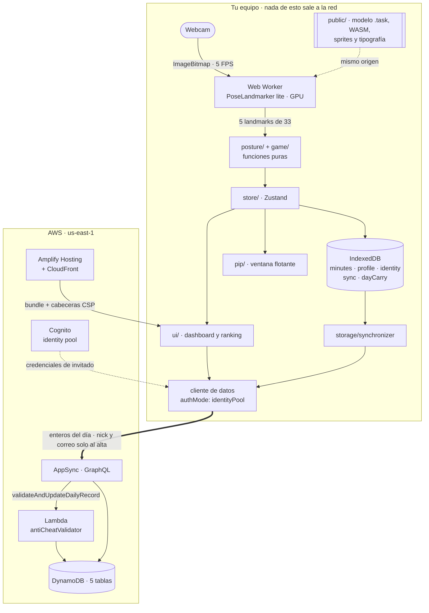

No existe ninguna arista de AWS hacia el worker: el modelo y el runtime WASM se sirven
desde el propio origen (`public/`), condición que permite limitar `connect-src` a dos
orígenes en la política de seguridad de contenido. La única vía de escritura hacia
DynamoDB atraviesa la función Lambda de validación; el navegador no dispone de acceso
directo a las tablas.

`amplify/hosting/custom-headers.yml` · `src/vision/cameraSource.ts` ·
`src/storage/synchronizer.ts` · `amplify/data/resource.ts`

---

## 2. Casos de uso

El sistema contempla un único actor con dos niveles de capacidad, representados en el
código por los dos valores de `identityPhase`. La distinción es funcional y no
cosmética: sin identidad activa, el sincronizador termina su ejecución antes de emitir
cualquier operación.

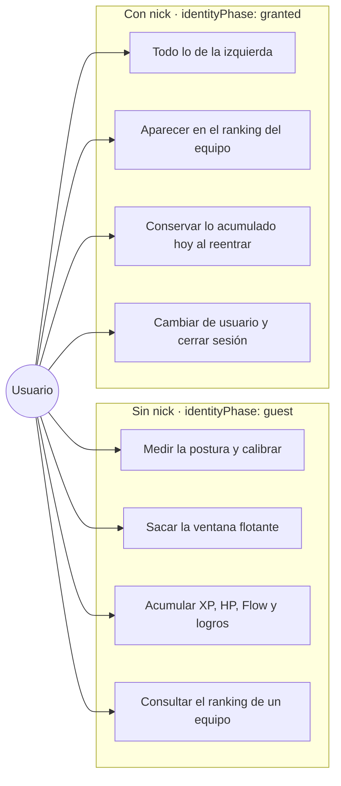

Consultar el ranking no exige nick, ya que basta un código de equipo, pero figurar en él
sí lo requiere: cada fila se identifica por `displayName`, que es el nick. El caso B3
merece una precisión. Al volver a entrar el mismo día, el cliente parte de cero segundos
acumulados; son el acarreo (`storage/dayCarry.ts`) y el suelo monótono que aplica la
Lambda los que impiden que ese valor sobrescriba la fila ya existente en el ranking.

`src/store/useAppStore.ts` (`identityPhase`) · `src/ui/GuestNotice.tsx` ·
`src/ui/SyncControl.tsx` · `src/storage/synchronizer.ts` · `src/storage/dayCarry.ts`

---

## 3. Recorrido de la interfaz

La navegación se compone de dos máquinas de estados anidadas: la de la vista, en
`App.tsx`, y la de la fase de identidad, que `NickGate` gobierna sobre `identityPhase`.

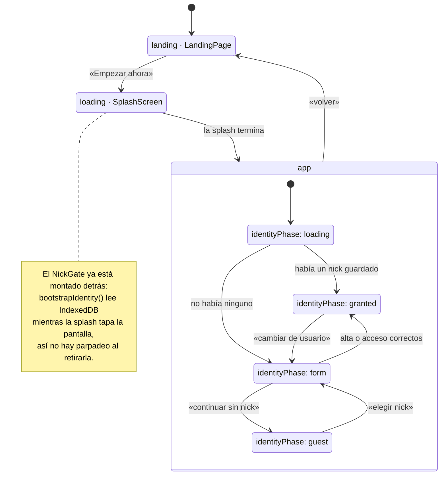

Las fases `granted` y `guest` renderizan el mismo dashboard; la diferencia reside en qué
componentes se montan dentro de él y en si el sincronizador arranca. La acción «cambiar
de usuario» invoca `clearAllLocalUserData()` antes de devolver al formulario, con lo que
el siguiente nick no hereda los minutos acumulados por el anterior.

`src/App.tsx` · `src/ui/NickGate.tsx` · `src/store/useAppStore.ts`

---

## 4. Dependencias entre módulos

El grafo se deriva de los `import` relativos de todos los ficheros `.ts` y `.tsx` de
`src/` que no son tests. Se omiten `src/assets/`, que contiene imágenes, y los ficheros
de prueba.

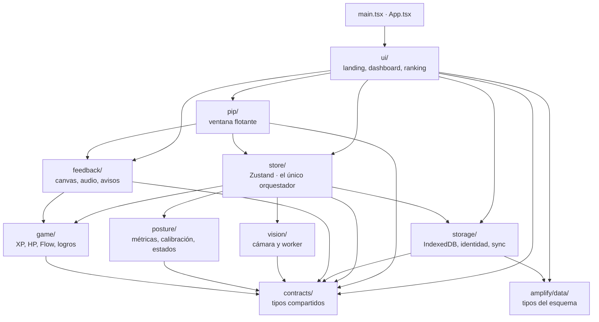

Las propiedades que sostienen esta organización son cuatro:

- `contracts/` no importa nada del proyecto. Es el sumidero del grafo, y esa condición es
  la que le permite actuar como idioma común entre módulos sin introducir ciclos.
- `posture/` y `game/` dependen únicamente de `contracts/`. Al ser funciones
  puras, pueden probarse contra los fixtures sin cámara ni navegador.
- El store es el único módulo que conoce simultáneamente `vision/` y `posture/`. Crea el
  `CameraSource` y lo inyecta en `createPostureSource(source)` como un `LandmarkSource`,
  de forma que `posture/` no sabe que existe una cámara y `vision/` no sabe qué se hace
  con los landmarks.
- Dos aristas se apartan del patrón general. `feedback/ → game/` existe porque `hud.ts`
  emplea `xpProgress` para que el HUD del canvas y el dashboard no muestren cifras
  distintas. `ui/ → storage/` existe porque el `RankingPanel` consulta el ranking y la
  identidad local sin pasar por el store; es una excepción pendiente de reubicar.

Ningún módulo importa `ui/` ni `pip/` salvo la raíz: la interfaz ocupa el extremo final
de la cadena de dependencias.

---

## 5. Del frame al veredicto

La secuencia siguiente describe el ciclo que se repite cinco veces por segundo, desde la
captura de la webcam hasta la actualización de la mascota.

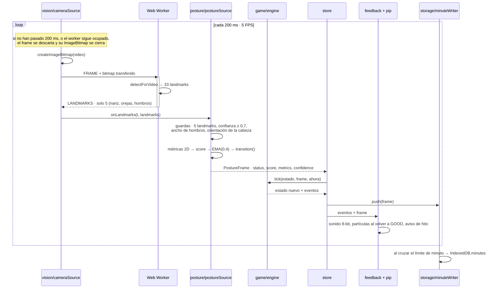

El descarte de frames es el mecanismo que mantiene acotado el presupuesto de cómputo: se
comparan marcas de `performance.now()` en lugar de encolar los frames entrantes, y el
`ImageBitmap` de todo frame descartado se cierra siempre, sin lo cual la pestaña acumula
memoria con rapidez. El motor de juego recibe el instante actual como parámetro
(`tick(state, frame, now)`) y no consulta el reloj por su cuenta.

`src/vision/cameraSource.ts` · `src/posture/pipeline.ts` · `src/game/engine.ts` ·
`src/store/useAppStore.ts` (`pushFrame`) · `src/feedback/feedbackBridge.ts`

---

## 6. Estados de la postura

La máquina define cuatro estados y una regla común a todos ellos: ninguna transición es
inmediata.

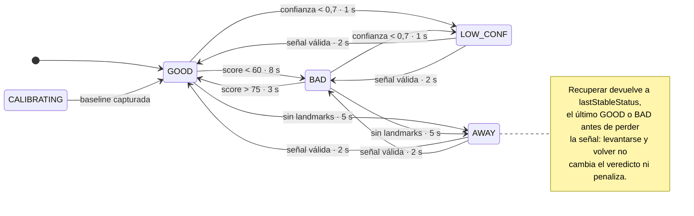

Los umbrales de entrada y de salida son distintos de forma deliberada, 60 para caer y 75
para volver, y además cada transición debe sostenerse durante un tiempo mínimo. El
mecanismo es idéntico en todos los casos:

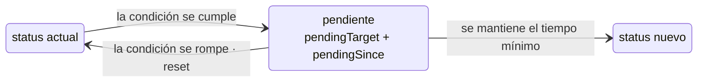

El estado `CALIBRATING` no lo produce la máquina de estados, sino `postureSource`
durante los cinco segundos de calibración; el motor de juego lo trata igual que `AWAY` y
`LOW_CONF`, congelando toda la mecánica. Las reglas se evalúan en un orden fijo de
prioridad: ausencia, confianza baja, recuperación, caída a `BAD`, subida a `GOOD` y
reset.

`src/posture/stateMachine.ts` · `src/posture/postureSource.ts` · `src/game/engine.ts`

---

## 7. Alta de un nick

La unicidad no se comprueba leyendo y escribiendo después, porque entre ambas operaciones
cabe otra alta simultánea. Se delega en la condición de escritura que DynamoDB aplica
sobre la clave de partición de `NickClaim` y `EmailClaim`: un `create` con una clave ya
existente falla en el servidor y no deja registro parcial.

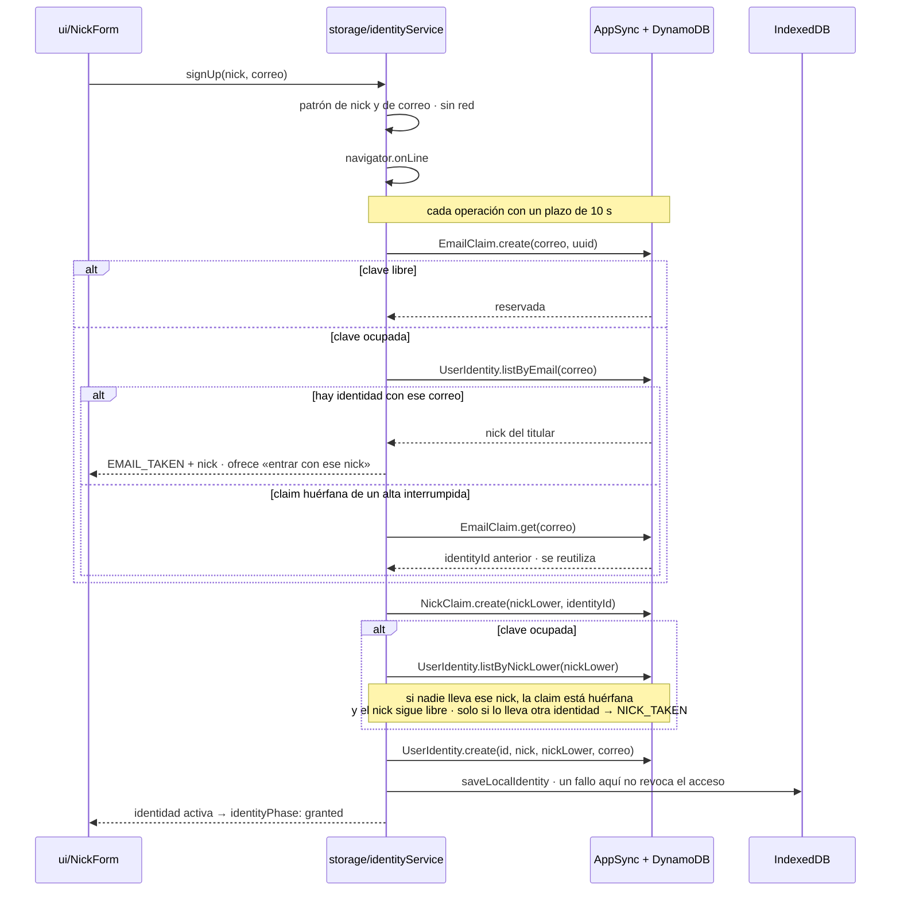

Las dos ramas de «clave ocupada» responden a una necesidad concreta. Ninguna claim se
elimina nunca, de modo que existen claims huérfanas: correos reservados por un alta que
se interrumpió y nicks abandonados tras un cambio de nick. Sin la comprobación contra
`UserIdentity`, un nick abandonado quedaría permanentemente inservible, con la vía «ya
tengo nick» indicando que no está registrado y la vía «crear nick» indicando que ya está
en uso.

`src/storage/identityService.ts` · `src/storage/identityClient.ts` ·
`amplify/data/resource.ts`

---

## 8. Acceso con un nick existente

Entrar con un nick ya creado exige el correo con el que se reclamó. Esta comprobación
constituye la capa de verificación de titularidad.

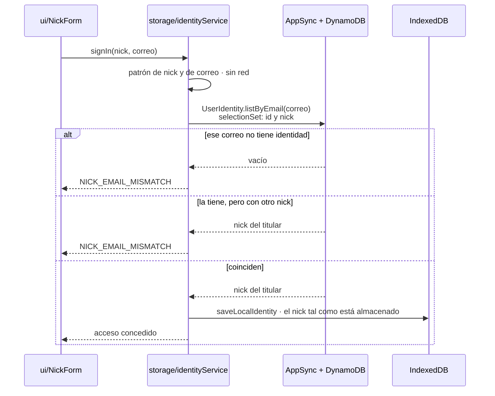

Dos decisiones sostienen este flujo:

1. **La consulta se realiza por correo y no por nick.** La comprobación necesita
   enfrentar dos valores, y el que se recupera del servidor queda expuesto en el cliente.
   Consultando por nick habría que traer el correo almacenado para compararlo en el
   navegador, con lo que cualquiera que conociera un nick podría leer el correo de su
   titular. Consultando por correo, lo que retorna es el nick, dato que el ranking ya
   publica, y el correo no sale del servidor.
2. **Los dos motivos de rechazo comparten un único mensaje.** Distinguir «ese correo no
   existe» de «ese correo pertenece a otro nick» permitiría enumerar correos registrados.

El alcance de esta capa está declarado en [PRIVACY.md](PRIVACY.md), limitación 7: la
comprobación la resuelve el cliente y las credenciales de invitado permiten leer
`UserIdentity` y `EmailClaim`. Disuade el acceso casual, no un intento deliberado.

`src/storage/identityService.ts` (`signIn`) · `src/storage/identityErrors.ts`

---

## 9. Modelo de datos

El esquema define cinco modelos en `amplify/data/resource.ts`. No existen claves ajenas,
puesto que DynamoDB no las contempla: las relaciones del diagrama son lógicas y las
sostiene el código de aplicación.

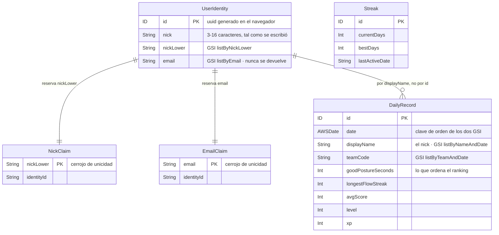

| Modelo | Clave | Índices secundarios | Autorización |
|---|---|---|---|
| `UserIdentity` | `id` | `listByNickLower`, `listByEmail` | invitado: crear, leer, actualizar |
| `NickClaim` | `nickLower` | — | invitado: crear, leer |
| `EmailClaim` | `email` | — | invitado: crear, leer |
| `DailyRecord` | `id` | `listByTeamAndDate`, `listByNameAndDate` | invitado: crear, leer, actualizar |
| `Streak` | `id` | — | `allow.owner()` |

Tres aspectos del modelo requieren explicación:

- **`DailyRecord` se relaciona con la identidad por `displayName` y no por `id`.** Así la
  Lambda puede localizar la fila de un nick y un día sin depender del puntero que el
  cliente guarda en IndexedDB, que desaparece al borrar los datos del sitio o al entrar
  desde otro navegador. Antes de existir `listByNameAndDate`, cada pérdida de ese puntero
  generaba una fila adicional del mismo nick para el mismo día.
- **`Streak` está declarado pero no se utiliza.** `allow.owner()` exige un usuario
  autenticado y la aplicación solo emplea credenciales de invitado desde que se retiró el
  Authenticator, por lo que no existe ninguna ruta que lo alcance. El nombre aparece una
  única vez en el repositorio, en `resource.ts`. La racha que muestra la interfaz se
  calcula en local, en `storage/streakCalculator.ts`.
- La mutación `validateAndUpdateDailyRecord` es la única puerta de escritura del
  sincronizador. El rol de la Lambda dispone de permisos `mutate` y `query`, ya que
  necesita consultar `listByNameAndDate` antes de decidir si crea o actualiza la fila.

---

## 10. Sincronización y anti-trampa

El recorrido de un minuto registrado en local hasta el ranking pasa por el veredicto del
servidor.

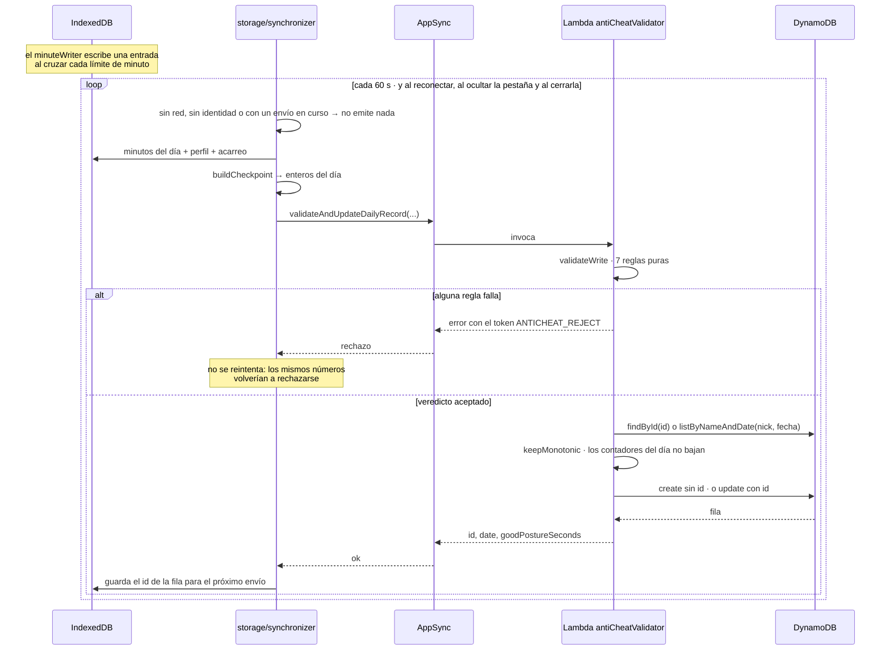

Las siete reglas se evalúan en el orden fijo siguiente:

| Regla | Rechaza cuando |
|---|---|
| `DATE_WINDOW` | la fecha declarada dista más de un día de la fecha UTC de recepción |
| `DAILY_MAX` | `goodPostureSeconds` pasa de 86 400 (un día) |
| `ELAPSED_TODAY` | declara más segundos que los transcurridos del día, con 50 400 s de margen por zona horaria |
| `FLOW_VS_GOOD` | la racha de Flow supera los segundos de buena postura, con 60 s de margen por el redondeo a minutos |
| `AVG_SCORE_RANGE` | `avgScore` cae fuera de 0-100 |
| `LEVEL_XP_COHERENCE` | el nivel no cuadra con el XP según `100 × nivel^1,5` |
| `INCREMENT_VS_ELAPSED` | el incremento supera el tiempo desde la última escritura × 1,1 |

Las seis primeras reglas examinan solo los valores declarados, de modo que su resultado
no depende de lo que el cliente afirme sobre el estado anterior; `INCREMENT_VS_ELAPSED`
únicamente se evalúa cuando llegan los valores previos. La distinción determinante es la
del token: un error con `ANTICHEAT_REJECT` constituye un veredicto y no se reintenta,
mientras que cualquier otro error, sea de permisos, de red o por una mutación no
desplegada, se considera un fallo de infraestructura y se reintenta hasta tres veces con
espera exponencial. Sin esa distinción, un fallo de red se interpretaría como una
acusación de trampa.

`src/storage/minuteWriter.ts` · `src/storage/synchronizer.ts` ·
`amplify/data/anti-cheat-handler/rules.ts` ·
`amplify/data/anti-cheat-handler/decision.ts`

---

## 11. Despliegue

Un `git push` a `main` construye el backend y el frontend en el mismo contenedor, en ese
orden. La secuencia es obligatoria: `amplify_outputs.json` lo genera la fase de backend y
`src/main.tsx` lo importa de forma estática, por lo que sin esa fase el frontend no
compila.

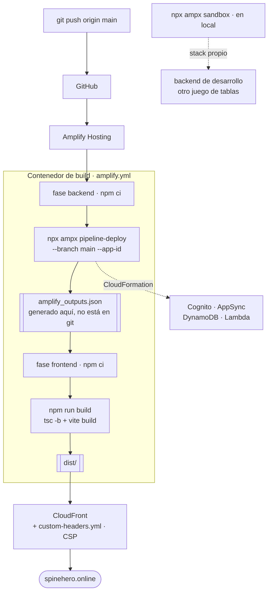

El sandbox y el backend de la rama desplegada son entornos independientes, con dos juegos
de tablas, dos APIs y dos pools. Los nicks y los `DailyRecord` creados en local no
aparecen en el sitio publicado, y ese comportamiento es el esperado.

`amplify.yml` · `amplify/backend.ts` · `amplify/hosting/custom-headers.yml`

---

## Especificaciones

Los diagramas anteriores ofrecen una vista de conjunto. La fuente de verdad de cada
funcionalidad son sus especificaciones, que contienen los requisitos en formato EARS, el
diseño y las tareas:

| Spec | Cubre |
|---|---|
| [`pipeline-vision`](../.kiro/specs/pipeline-vision/) | cámara, worker, presupuesto de cómputo |
| [`deteccion-postura`](../.kiro/specs/deteccion-postura/) | métricas, calibración, scoring, estados |
| [`postura-lateral`](../.kiro/specs/postura-lateral/) | detección de orientación de la cabeza |
| [`juego-feedback`](../.kiro/specs/juego-feedback/) | motor, canvas, audio, notificaciones |
| [`shell-app`](../.kiro/specs/shell-app/) | landing, dashboard, ventana flotante |
| [`backend-nube`](../.kiro/specs/backend-nube/) | esquema, sincronización, anti-trampa |
| [`identidad-nick`](../.kiro/specs/identidad-nick/) | alta, acceso, titularidad, ranking |
